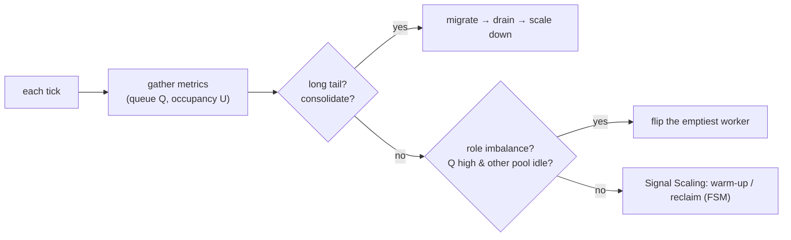

# Cloud-Native Autoscaling for Disaggregated LLM Inference

**Elastic prefill/decode role switching and in-flight request consolidation for reinforcement-learning inference workloads.**


&nbsp;License: Apache-2.0
&nbsp;Stack: Kubernetes · NVIDIA Dynamo · vLLM · NIXL

Reinforcement-learning post-training (RLHF, GRPO) drives inference in **phases**:
a prefill-heavy sampling burst, a long decode phase, then a sparse long tail — and
then the GPUs should be freed for the next rollout or a training step. A static
prefill/decode (PD) split wastes GPU-hours at every phase boundary, and Kubernetes
autoscaling reacts in *minutes* — an order of magnitude too slow to act *inside* a
rollout phase.

This project reshapes a **fixed** pool of GPUs to follow those phases, in
**sub-second** control time, through two mechanisms driven by an external RL signal:

- **Role Switch** (Elastic PD role switching) — flip a single vLLM worker between prefill and
  decode *in place*, with no engine rebuild and no cold start (~0.9 s, zero request loss).
- **Consolidation** (In-flight request consolidation) — live-migrate long-tail decode requests
  onto fewer decoders and release a GPU early, with an at-least-one-copy invariant.

Both are orchestrated by an **RL-signal-driven control plane** that closes the loop
over Prometheus metrics, Kubernetes discovery, worker sidecars, and vLLM engine state.

---

## Architecture


*Discovery is via Kubernetes `DynamoWorkerMetadata` CRs. Each worker runs one vLLM
`kv_both` engine with a `NixlConnector`, a prefix cache + KVBM, and the RL-Scaling
sidecar (`:9091` — `/switch_role`, `/migrate_*`). The frontend's `ModelWatcher`
(WorkerSet / KvRouter / PrefillRouter) watches the CRs; the RL-Scaling controller
carries the RL signal plus the role-switch and consolidation logic.*

A worker's role is simply **which ModelCard it publishes** to its Kubernetes
`DynamoWorkerMetadata` CR; the frontend routes by *watching* those CRs. The
controller and the sidecars form a control plane that is entirely separate from the
request data path.

---

## The three levers, on three timescales

| Lever | Acts on | In one line |
|-------|---------|-------------|
| **Signal Scaling** | replica count (K8s) | pre-warm and reclaim pods on the RL phase signal (a 4-state FSM). |
| **Role Switch** | a worker's *role* | in-place hand idle capacity to the bottleneck role — no engine rebuild. |
| **Consolidation** | request *placement* | migrate long-tail requests onto fewer decoders, then release a GPU. |

> Signal Scaling changes **replicas**, Role Switch changes a worker's **role**, Consolidation
> changes a request's **placement** — all in sub-second control time, at a fixed GPU count.

### Role Switch — the switch protocol (zero-loss envelope + engine core)

A role flip runs as two nested layers so no request is lost across it:

```
E1 cordon          router stops sending this worker new work
E2 drain + settle  in-flight requests finish
E3 outbound-KV     wait until any peer still PULLING this worker's KV finishes
   ─────────────── (safe window) ───────────────
C1 sleep           free GPU KV blocks
C2 reconfig NIXL   drop + lazily rebuild the connector for the new direction
C3 reset prefix    clear the prefix-cache index while asleep (kills stale refs)
C4 register MDC    publish the new-role ModelCard
C5 wake            resume generation
```

Mean flip time **941 ms**, dominated by two *fixed* terms (a Kubernetes ModelCard
round-trip and a drain window); engine work is ~115 ms. Because the cost is O(1)
while the batch is O(n), it amortizes as rollouts grow.

### Consolidation — three-phase block-hold migration

`migrate_out` pins the most-progressed request's KV on the source (does **not**
abort it) → `migrate_in` has the target pull the KV over NIXL (recompute is the
fallback) and resume decoding → `migration_complete` releases the source. The
request's KV lives on ≥1 GPU at every instant (**at-least-one-copy**); any failure
rolls back and the request keeps running on the source. Zero KV loss, zero
in-flight request loss.


*The three phases between the orchestrator, the drained decoder, and its peer. In the
diagram, `D_src` is the **source** being drained (`/migrate_out`) and `D_dst` is the
**destination** peer that receives the request (`/migrate_in`). It illustrates the
connector (NIXL-pull) path; on this no-RDMA cluster the runs take the equivalent
**recompute** fallback, which re-prefills the already-generated tokens on the destination.*

### The control loop



Each tick evaluates **Consolidation → Role Switch → Signal Scaling** (draining first creates cheap re-role
candidates). Decisions use two quantities per pool — backlog `Q` and occupancy `U` —
plus a signal-derived term that folds the rollout's *known upcoming* prefill demand
into `Q` before it queues.

---

## Evaluation

A phased 96-request workload (prefill burst → dense decode → 3-request long tail)
on a real Kubernetes GPU cluster (Qwen3-0.6B on vLLM under Dynamo), five scenarios ×
three runs, compared against a same-topology **2P2D** control. GPU-seconds are
integrated **by the role each pod actually held** at each tick (a live census), not
by its static deployment. Prompts carry a per-run nonce so the prefix cache never
warms one scenario from another.

**Role Switch reallocates capacity at a fixed 4 GPUs** — capacity follows demand:

| Group | prefill GPU·s (2P2D → switch) | decode GPU·s (2P2D → switch) |
|-------|------------------------------|------------------------------|
| A prefill burst | 75.4 → **133.3 (+77%)** | 75.4 → 63.5 |
| B decode dense  | 45.8 → 50.6 | 45.8 → **50.4** |

Router prefill-queue wait 29.5 → 24.7 ms; decode-phase TTFT 327 → 291 ms.

**Consolidation reclaims GPU time** — pool contracts 2 → 1 decoders, GPU freed **12.2 s early**,
at the cost of a slightly longer tail (makespan 82.9 → 85.4 s).

---

## Repository layout

```
rl-scaling-controller/   the control plane — the scaling FSM, the role-switch decision
                         engine, the consolidation decision engine, metrics collector
rl-signal-sdk/           a small SDK for emitting RL rollout phase signals
deploy/                  Kubernetes manifests (dual-mode workers, RBAC, controller)
test-scripts/            the phased-workload evaluation harness + gate checks
dynamo-integration/      the worker-side (data-plane) changes: patch + explanation
tutorial/                deployment guides
```

The **worker-side** protocol (in-place role flip, live migration) lives in a fork of
[NVIDIA Dynamo](https://github.com/ai-dynamo/dynamo) — see
[`dynamo-integration/`](dynamo-integration/) for the self-contained patch and a full
explanation of what changed and why.

---

## Getting started

The control plane is standard Python:

```bash
cd rl-scaling-controller
pip install -e .
pytest                       # unit tests for the scaling / role-switch / consolidation logic
```

Running the full end-to-end evaluation needs a Kubernetes cluster with GPU nodes and
the Dynamo runtime built from the [fork branch](dynamo-integration/). The evaluation
harness and its quality gates are in [`test-scripts/`](test-scripts/); image-build
and CI/CD notes are in [`RL-SCALING-IMAGE-BUILD.md`](RL-SCALING-IMAGE-BUILD.md) and
[`CICD.md`](CICD.md).

---

## License

[Apache-2.0](LICENSE). The worker-side changes derive from NVIDIA Dynamo, which is
also Apache-2.0.
