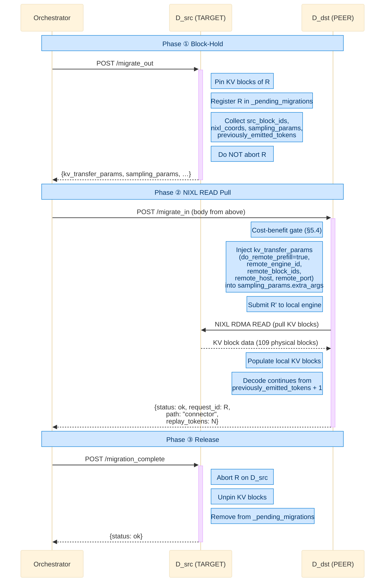

# Elastic PD Role Switching and In-Flight Decoder Request Consolidation on NVIDIA Dynamo for Reinforcement-Learning LLM Inference

> **Subtopic:** Cloud-Native LLM Serving — Scale on NVIDIA Dynamo  
> **Author:** Shengqi ZHANG  
> **Institution:** HKUST MSc Thesis  
> **Baseline:** NVIDIA Dynamo v1.0.1 (Latest Stable, 2026-03)  
> **Date:** 2026-05-19

A glossary of all repository-specific terms (DWMD, ModelCard, TCP slot, port assignments, WorkerSet, …) used in this report is collected in **Appendix A** for reference.

---

## ABSTRACT

**Prefill–Decode (PD) disaggregation** is the mainstream LLM inference architecture (exemplified by **NVIDIA Dynamo**), splitting compute-bound prefill and bandwidth-bound decode onto separate GPU pools to maximize online serving efficiency. However, in **reinforcement-learning (RL) post-training**, inference traffic bursts periodically with rollout phases, leaving pools alternately idle and wasting GPU-hours; horizontal scaling (cold start ≈ tens of seconds) cannot react within a single rollout phase. The core question: *can the decode/prefill pool sizes be reshaped within hundreds of milliseconds, without dropping in-flight requests or disturbing the router?*

This report introduces two runtime primitives on Dynamo + vLLM 0.16: (1) **Elastic PD Role Switching** — a state-machine-driven in-place protocol that flips a worker's role via DWMD ModelCard mutation and engine sleep/wake cycling in sub-second time, with no engine rebuild or pod redeploy; (2) **In-Flight Decoder Request Consolidation** — a three-phase block-hold protocol that migrates running decode requests across GPUs via NIXL RDMA pull, with zero KV loss. Together with an RL-signal-driven autoscaling controller, these primitives enable the decode/prefill pools to be dynamically reshaped in lockstep with RL phases.

On a single-node Kubernetes deployment of `Qwen3-0.6B`, end-to-end validation shows:

* a full decode→prefill→decode round-trip completes in **963 ms** of client wall-clock (453 ms + 428 ms server-side);
* an in-flight decode that had already generated **1688** tokens is migrated off the source decoder onto a peer in **188 ms** via the `NixlConnector` RDMA path, transferring **109 physical KV blocks** without recomputing the prefix (the destination's `migrate_in` response reports `"path": "connector"`, the source's `migrate_out` returns fully-populated `kv_transfer_params`, and the client-visible SSE stream completes without token loss);
* a sustained 2 RPS background load across the full switch+revert sequence completes **58/58 requests with zero HTTP errors** (p50 = 65 ms, p99 = 105 ms).

---

## 1. INTRODUCTION

### 1.1 NVIDIA Dynamo at a Glance

NVIDIA Dynamo (v1.0.1 GA, 2026-03) is an open-source serving framework for disaggregated LLM inference. Architecturally it is a Rust runtime that hosts (i) a **frontend** pod terminating OpenAI-style HTTP, (ii) any number of **worker** pods each wrapping a vLLM engine, and (iii) a discovery layer that uses Kubernetes Custom Resources (DWMD) as the *single observable source of truth* for worker membership. The frontend embeds two stateful routers — `KvRouter` for decode dispatch and `PrefillRouter` for prefill dispatch — and a `ModelWatcher` that maintains the WorkerSet by `list+watch`ing DWMD CRs. KV-cache transfer between prefill and decode workers is performed by the **NIXL** connector over NVLink / RDMA. This stack is the *de facto* mainstream choice today for production PD-disaggregated serving and is the baseline on which our extensions are built.

### 1.2 The RL Workload and Its GPU-Waste Problem

The cost economics of LLM inference are dominated by GPU-hours. In *online* chat-style serving the traffic is near-stationary; static PD partitioning works because both pools stay busy. The **RL rollout loop** that drives modern post-training methods (RLHF, DPO, GRPO) submits inference traffic in a fundamentally different pattern:

```
  ┌──────────┐   ┌────────────┐   ┌──────────┐   ┌──────────┐
  │ Sampling │──▶│ Batch Infer│──▶│ Training │──▶│ Sampling │──▶ ...
  │ GPU idle │   │  GPU busy  │   │ GPU busy │   │ GPU idle │
  └──────────┘   └────────────┘   └──────────┘   └──────────┘
   ◄─ idle ──▶◄── burst ──▶◄── train ──▶◄─ idle ──▶
```

Each phase boundary leaves one of Dynamo's GPU pools fully busy and the *other* completely idle. Two compounded sources of waste result:

1. **Cross-phase pool waste.** Prefill GPUs are busy only during the prompt-processing burst; decode GPUs are busy only during the long-tail generation. The pool that is currently idle still holds a GPU allocation and is still being paid for.
2. **Intra-phase tail waste.** Near the end of a batch the running set on each decoder shrinks toward zero. A nearly-empty decoder cannot release its GPU because a handful of long completions are still running.

Standard elasticity mechanisms are structurally mismatched to this workload on two grounds. First, **horizontal pod scaling** incurs a cold-start latency on the order of tens of seconds (image pull, engine construction, model-weight load, NIXL handshake), which is one to two orders of magnitude larger than the sampling phase it would need to react inside; furthermore each new pod starts with an empty prefix cache, discarding the prefix-reuse benefit that PD disaggregation was designed to expose. Second, **static over-provisioning** sizes both pools for the peak demand of the worst-tolerated phase, and therefore lower-bounds GPU expenditure at the peak even while either pool is idle, defeating the goal of bounded $\text{GPU}_{\text{hours}}$ in §1.3. Both mechanisms fail the RL controller's requirement to act *within* a single rollout phase.

### 1.3 Optimization Targets

We formalize the RL workload's goals:

$$
\text{Minimize } T_{\text{batch}} = \max_{r \in \text{Batch}} T_{\text{complete}}(r)
\qquad
\text{Minimize } \text{GPU}_{\text{hours}} = \sum_{g \in \text{GPUs}} T_{\text{allocated}}(g)
$$

$$
\text{Maximize } U_{\text{GPU}} = \frac{\sum_g T_{\text{compute}}(g)}{\sum_g T_{\text{allocated}}(g)}
$$

The lever is $U_{\text{GPU}}$: by *re-roling* idle GPUs into the currently-bottlenecked phase and by *consolidating* tail-end decode work onto fewer GPUs, the system raises useful work per allocated GPU-hour. The operation must complete in **sub-second** time so an RL controller can act *inside* one rollout phase.

### 1.4 Why This Is Hard in vLLM + Dynamo Today

Three structural facts of the vLLM 0.16 + Dynamo v1.0.1 stack make naive elasticity unsafe:

1. **`kv_transfer_config` is fixed at engine construction.** The NIXL connector binds to *one* role at engine boot. Any run-time "role switch" must not rebuild the engine.
2. **vLLM's prefix cache is an *index* over KV blocks** that `engine.sleep(level=2)` returns to the GPU allocator. Without a synchronized reset, a resumed engine can serve stale hits.
3. **Dynamo's router is stateful.** `KvRouter` and `PrefillRouter` carry radix-tree KV indices and per-worker cost models. A role change must propagate through DWMD and reconverge this state without disrupting in-flight requests.

### 1.5 Contributions

* **(C1) An eight-step in-place role-switch state machine** (`DualModeWorker.switch_role`) that combines `engine.sleep(2) → ModelCard unregister → NIXL reset → prefix-cache reset → role flip → ModelCard register → engine.wake_up → role-changed event` into an *atomic-from-the-scheduler's-perspective* operation. Measured: **453 ms server-side, 497 ms client wall-clock** (decode→prefill); **428 / 466 ms** in reverse.
* **(C2) A single-TCP-slot dispatcher for partner-prefill**, which lets the same vLLM engine — pre-built with `kv_role=kv_both` and one `(connection_id, "generate")` TCP slot — serve chat (decode) or prefill traffic at run-time, routed at request time by `dual_mode.current_role`.
* **(C3) A three-phase block-hold NIXL-pull migration protocol** (`migrate_out → migrate_in → migration_complete`) that consolidates running decoders by *pulling* GPU KV blocks across NVLink, with the source pinning the blocks across the handshake (zero KV loss) and a 10 s sweep timer preventing block leakage on orchestrator failure.
* **(C4) An RL-signal-driven autoscaling controller** that consumes rollout-phase signals and dispatches the above primitives.
* **(C5) End-to-end validation** on a Kubernetes deployment of `Qwen3-0.6B`: CRD-level discovery diff *and* Prometheus-level prompt-token attribution prove the role switch; per-request `left_TARGET ∧ accepted_at_PEER` assertions over six concurrent migrations prove the consolidation.

The remainder of the report: §2 surveys the relevant runtime fabric; §3 introduces the deployment topology and port model; §4 details the role-switch protocol; §5 details the consolidation protocol; §6 describes the RL-signal autoscaler; §7 presents validation; §8 discusses limitations and future work.

---

## 2. BACKGROUND AND RELATED WORK

### 2.1 Prefill–Decode Disaggregation: a Mainstream Practice

**Why it exists.** LLM inference of every request goes through two serial phases that share the *same* model weights but have *different* resource bottlenecks:

| Phase | Inputs | Computation | Bottleneck |
|-------|--------|-------------|-----------|
| **Prefill** | All `N` prompt tokens at once | One forward pass through every transformer layer with `|Q|=|K|=|V|=N` | Compute-bound (large GEMM) |
| **Decode** | One new token + the existing KV cache | One forward pass with `|Q|=1`, `|K|=|V|=N+t` | Memory-bandwidth-bound (KV read) |

Co-locating both phases on one GPU (continuous batching) maximizes raw throughput but causes severe head-of-line blocking: a single long prefill stalls a batch of fast decodes, hurting per-request latency. **PD-disaggregated serving** — pioneered by Splitwise and DistServe and now the mainstream pattern adopted by NVIDIA Dynamo, vLLM-disagg, and SGLang-disagg — splits the two phases onto *separate* GPU pools. The prefill pool produces the KV cache and ships it to the decode pool over a high-bandwidth fabric (NVLink / RDMA via NIXL). The advantages are:

* compute-bound and bandwidth-bound work no longer interfere;
* each pool can be sized and scheduled to its own bottleneck;
* prefix caching becomes a first-class cross-request optimization (cache lives on the decode side, shared across decodes that share a prompt prefix).

**Figure 1 — Prefill–Decode disaggregated request flow (placeholder).**

```
                            ┌────────────────────────┐
       prompt (N tokens) ──►│  Prefill Worker (GPU)  │── KV blocks ──┐
                            │  big GEMM, 1 forward   │  via NIXL     │
                            └────────────────────────┘               │
                                                                     ▼
                                                       ┌────────────────────────┐
                                  token N+1, N+2, … ◄──│  Decode Worker (GPU)   │
                                                       │  small GEMM,           │
                                                       │  KV-read-bound, loops  │
                                                       └────────────────────────┘
```

**The unavoidable cost.** The split inherits a structural inefficiency: the *ratio* of compute to memory traffic in a workload may not match the *ratio* of prefill to decode GPUs that the operator provisioned, so one pool is idle while the other is the bottleneck. This is the leverage point of this work.

### 2.2 NVIDIA Dynamo Runtime

Dynamo provides the routing and discovery substrate on top of stateful vLLM engines. The three subsystems this work depends on:

* **Discovery layer** (`lib/runtime/src/discovery/kube.rs`). With `DYN_DISCOVERY_BACKEND=kubernetes`, each worker pod owns a **`DynamoWorkerMetadata` (DWMD) CR** whose `spec.data.{endpoints, event_channels, model_cards}` *is* the worker's runtime registration. The worker calls `apply_cr()` (strategic-merge-patch) to add or remove entries; the frontend's `ModelWatcher` `list+watch`es DWMDs to rebuild its WorkerSet. There is no etcd and no central registry — DWMD is the single source of truth.
* **`KvRouter` + `PrefillRouter`** (`lib/llm/src/kv_router/`). Stateful routing engines. `KvRouter` maintains a radix-tree index over KV blocks held by each decoder, scoring candidates as

  $$
  \text{logit}(w) = \alpha \cdot \frac{\text{overlap\_blocks}(w)}{\text{total\_blocks}} + \beta \cdot \text{queue\_load}(w) + \gamma \cdot \text{capacity}(w)
  $$

  and selecting via `softmax_sample` (argmin at `temperature=0`). `PrefillRouter` fans prefill traffic to any *prefill-role* ModelCard discovered through DWMD. When a worker's role changes, the entire state machine must reconverge through DWMD propagation.
* **NIXL connector & KVBM** (`lib/llm/src/kvbm/`, vLLM `NixlConnector`). NIXL provides zero-copy cross-GPU KV transfer over NVLink (RDMA over IB for multi-host). KVBM tracks per-request GPU-block layout. Together they enable a decoder to *pull* KV blocks directly from another worker's VRAM, which §5 uses for in-flight consolidation.

**Figure 2 — Dynamo runtime architecture (placeholder).**

```
   ┌──────────────────────────┐         ┌────────────────────────────┐
   │  Frontend Pod            │  watch  │  Worker Pod                │
   │  ─────────────           │ ◄───────┤  ─────────────             │
   │  HTTP :8000 (OpenAI)     │  DWMD   │  Dynamo runtime (Rust)     │
   │  ┌────────────────────┐  │         │   - apply_cr() to own DWMD │
   │  │ ModelWatcher       │  │         │   - serves TCP slot:       │
   │  │  → WorkerSet       │  │         │     host:port/{cid}/gen…   │
   │  │  → KvRouter        │  │         │                            │
   │  │  → PrefillRouter   │  │         │  vLLM engine               │
   │  └─────────┬──────────┘  │         │   + NIXL connector         │
   │            │             │         │   + prefix cache + KVBM    │
   │            ▼             │         │                            │
   │   chosen TCP slot ───────┼─ generate ──────────────────────────►│
   └──────────────────────────┘         │   :9090 system / Prom      │
                                        │   :9091 RL-Scaling sidecar │
              ┌────────────────────┐    └────────────────────────────┘
              │  Kubernetes API    │
              │  CRDs: DGD, DWMD…  │
              └────────────────────┘
```

### 2.3 KV Cache and Prefix Caching

The KV cache stores the keys/values of every prior token so decode amortizes attention cost. **Prefix caching** reuses KV blocks across requests that share a prompt prefix. vLLM 0.16 keeps the cache **index** in CPU memory and the **blocks** pinned in GPU VRAM. This split is the *coherence target* of our role-switch protocol (§4.3): the index can outlive the blocks when `engine.sleep(2)` releases them to the GPU allocator, and a stale hit at wake-up will corrupt a later request.

### 2.4 Related Systems and Distinctions

| System | Elasticity primitive | Limitation this work addresses |
|--------|----------------------|--------------------------------|
| **Splitwise [5] / DistServe [4]** | Static PD partition at deploy time | No run-time role flip |
| **vLLM [2] native scaling** | Pod replicate | Cold start ≈ 30 s; loses prefix cache |
| **Mooncake [3]** | KV pool offload (CPU/SSD) | Orthogonal to PD; no role switch |
| **ServerlessLLM [8]** | Cold-start optimized serverless inference | Does not handle PD-disaggregated topology |
| **SpotServe [9]** | Spot instance migration | Instance-level granularity, not request-level |
| **This work** | In-place role switch + in-flight NIXL-pull migration | Sub-second elasticity *and* zero KV loss |

To our knowledge, no prior open-source serving system combines (a) sub-second in-place PD role flipping with (b) live decoder-to-decoder NIXL-pull migration, both controllable from an external RL signal.

---

## 3. SYSTEM OVERVIEW

### 3.1 Deployment Topology and Port Model

The RL-Scaling deployment extends a vanilla Dynamo `DynamoGraphDeployment` (DGD) with one pod-local component (the **RL-Scaling sidecar**) and one cluster-level component (the **RL-Scaling controller**).

**Figure 3 — Deployment topology (placeholder).**

```
┌──────────────────────────────────────────────────────────────────────────┐
│                       Kubernetes  (kube-apiserver)                       │
│  CRDs:  DynamoGraphDeployment | DynamoComponentDeployment |              │
│         DynamoWorkerMetadata (DWMD, 1 per worker pod)                    │
└─────────▲────────────────────────────────────▲───────────────────────────┘
          │ apply / watch                      │ apply / watch
┌─────────┴───────────────┐         ┌──────────┴────────────────────────┐
│ Frontend pod            │         │ Worker pod (dual-mode)            │
│  HTTP :8000             │  watch  │  Dynamo runtime (Rust)            │
│  ModelWatcher           │ ◄──DWMD─┤   one TCP slot:                   │
│   → WorkerSet           │         │     pod_ip:<dyn-port>/{cid}/gen   │
│   → KvRouter            │         │  vLLM (kv_both, +NIXL, +KVBM)     │
│   → PrefillRouter       │         │  :9090  Dynamo system / Prometheus│
└──────────┬──────────────┘         │  :9091  RL-Scaling sidecar        │
           │  TCP slot URL          │         /switch_role               │
           │  read from DWMD        │         /migrate                   │
           ▼                        │         /v1/active_requests        │
   chosen worker ───────────────────┼─► generate                        │
                                    └────────────────────────────────────┘
```

**The port model warrants an explicit table because the role-vs-port distinction is the most error-prone aspect of the deployment.** A dual-mode worker pod exposes *three* logical TCP services, and **none of them is the "decode port" or "prefill port" — the worker's role is encoded in the published `ModelCard`, not in the listening port.**

| Service | Port | Bound by | Role |
|---------|------|----------|------|
| Frontend HTTP API | `:8000` (ingress) | Frontend pod | OpenAI-style chat/completions intake |
| Request-serving slot | **dynamic** TCP port, allocated by the Rust runtime at engine boot; advertised in `DWMD.endpoints[…].transport.tcp = pod_ip:<port>/{connection_id:x}/generate` | Each worker pod | The actual `generate` endpoint that frontend routers connect to |
| System / Prometheus | `:9090` | Each worker pod | Internal metrics & health (**not** request-serving) |
| RL-Scaling sidecar | `:9091` | Each worker pod | Control-plane HTTP: `/switch_role`, `/migrate`, `/v1/active_requests`, `/v1/role` (**not** request-serving) |

The key invariant for dual-mode operation is:

> **One pod, one engine, one TCP slot — two ModelCards (decode + prefill) take turns owning that slot.**

The vLLM engine is built with `--kv-transfer-config NixlConnector kv_both --kv-events-config zmq`, so it carries the NIXL metadata for *both* roles from boot. The Rust runtime opens *exactly one* TCP slot keyed `{connection_id:x}/generate`. When the worker is acting as a *decoder*, the published ModelCard is `…/backend/generate/<instance>` whose transport URL points at that slot; when acting as a *prefill*, the ModelCard is `…/prefill/generate/<instance>` whose transport URL points at the **same** slot. A request-time dispatcher inside the slot's handler reads `dual_mode.current_role` and routes to the appropriate code path (§4.5). Thus **`switch_role` never reopens any socket**; it only renames the *entry* that the frontend's `ModelWatcher` observes in DWMD.

The RL-Scaling sidecar on `:9091` is a strictly separated *control plane*: it accepts `POST /switch_role` and `POST /migrate` from the controller (or a test harness) and drives `DualModeWorker` / `MigrationHandler`. It is never on the data path of a chat request.

### 3.2 Module Boundaries

| Module | File | Responsibility |
|--------|------|----------------|
| Discovery (Rust) | `lib/runtime/src/discovery/kube.rs` | Apply / watch DWMD CRs; the only writer of own pod's DWMD |
| `EngineHandler` (Python) | `components/src/dynamo/vllm/handlers.py` | Wraps vLLM `generate / sleep / wake_up`; per-pod request registry hooks |
| `VllmReregistrar` | `components/src/dynamo/vllm/main.py` | Per-role `endpoints_by_role` map; publishes / withdraws ModelCard for a given role into DWMD |
| `DualModeWorker` | `components/src/dynamo/vllm/dual_mode.py` | The eight-step state-machine `switch_role` orchestration |
| `MigrationHandler` | `components/src/dynamo/vllm/migration.py` | Three-phase `migrate_out / migrate_in / migration_complete`; victim selection; pending-migration sweep |
| RL-Scaling sidecar | `components/src/dynamo/vllm/rl_scaling_sidecar.py` | aiohttp on `:9091`; thin HTTP shell over `DualModeWorker` and `MigrationHandler` |
| RL-Scaling controller | `rl-scaling-controller/` | Cluster-level state machine; consumes RL signals; patches `DGD` replicas and dispatches `/switch_role` / `/migrate` |
| RL-Signal SDK | `rl-signal-sdk/` | Library used by the training job to emit rollout-phase signals |

### 3.3 Request Path (Recap)

A single chat request traverses the system in the following ordered steps:

1. The client issues `POST /v1/chat/completions` to the frontend on `:8000`.
2. Under PD-disaggregated mode, `PrefillRouter` first selects a prefill worker from the prefill subset of the WorkerSet, dispatches the prompt to it, and receives `kv_transfer_params` describing the KV blocks the prefill worker has produced.
3. `KvRouter` selects a decoder by scoring each candidate's radix-tree prefix-block overlap, queue load, and remaining KV capacity, then drawing via `softmax_sample` (argmin at `temperature=0`).
4. The frontend reads the chosen worker's transport URL from the corresponding `DWMD.endpoints[…].transport.tcp` entry and connects to its dynamic TCP slot `host:port/{cid:x}/generate`.
5. The worker's `generate` handler — gated by the request-time dispatcher of §3.1 on dual-mode pods — runs the request through the local vLLM engine, pulling prefill KV blocks via NIXL when `kv_transfer_params` is present.
6. Generated tokens stream back over the same TCP slot to the frontend, which forwards them as SSE chunks to the client.

The two new primitives introduced in §4 and §5 modify *only* worker-side state and the worker's own DWMD CR. The router code path of steps 2–4 is unchanged; it merely observes a different WorkerSet after each operation.

---

## 4. ELASTIC PD ROLE SWITCHING

### 4.1 Problem Definition

Given a running disaggregated deployment with $D$ decoder pods and $P$ prefill pods serving chat traffic at $r$ RPS through the frontend, an operator wants to instruct a specific decoder pod $D_i$ to *become a prefill worker* (and later *come back*) without restarting the pod, without dropping in-flight requests on the other pods, and within sub-second latency. Concretely, `POST <D_i>/switch_role {"target_role":"prefill"}` must achieve all of the following:

1. The chat `KvRouter` stops selecting $D_i$ (its decode WorkerSet membership is withdrawn);
2. $D_i$'s decode-side KV state is released (`engine.sleep(2)` returns GPU blocks to the allocator and `reset_prefix_cache` flushes the now-stale index);
3. $D_i$ subsequently serves prefill traffic that the frontend's `PrefillRouter` dispatches to it;
4. A reverse `target_role="decode"` restores step 1↔3 symmetrically;
5. The flip is fast enough (≪ 1 s) that an ongoing 2 RPS chat workload sees at most a few hundred milliseconds of routing dip (no permanent error increase);
6. The pod's name, IP, vLLM engine identity, and prefix-cache infrastructure are *unchanged*; only the *registered role* in DWMD and the engine's transient state are mutated.

Because the operation has internal sequencing constraints (sleep before unpublish before reset-cache before re-publish before wake), the implementation is a **state machine** rather than a flat script — see §4.2.

### 4.2 The Eight-Step State Machine

`DualModeWorker.switch_role(target)` runs under a per-worker async lock and proceeds through eight deterministic states; each transition is timed and surfaced in the JSON response's `timings_ms` field.

**Figure 4 — Eight-step `switch_role` state machine.**

```
   t →
   ┌──────────┐
1. │  sleep   │   handlers.sleep():
   │ (level=2)│     - registry.pause_generation() : reject new submits
   └─────┬────┘     - engine.sleep(2)             : free GPU KV blocks
         │
   ┌─────▼─────────┐
2. │ unregister_mdc│   reregistrar.unregister(role=current):
   │               │     remove ModelCard for current role from DWMD
   └─────┬─────────┘
         │
   ┌─────▼────────┐
3. │ reconfig_nixl│   handler._nixl_connector = None  (lazy re-init)
   └─────┬────────┘
         │
   ┌─────▼─────────────────┐
4. │ reset_prefix_cache    │   engine.reset_prefix_cache()  (while asleep)
   └─────┬─────────────────┘
         │
   ┌─────▼───────────────────┐
5. │ set_disaggregation_mode │   handler.current_role = target
   └─────┬───────────────────┘
         │
   ┌─────▼─────────┐
6. │  register_mdc │   reregistrar.register(role=target):
   │               │     publish ModelCard for new role into DWMD
   └─────┬─────────┘
         │
   ┌─────▼────┐
7. │   wake   │   engine.wake_up(); registry.resume_generation()
   └─────┬────┘
         │
   ┌─────▼──────────────┐
8. │ emit_role_changed  │   patch pod label
   │                    │     nvidia.com/dynamo-current-role=<target>
   └────────────────────┘
```

### 4.3 Critical Ordering Constraints

Three orderings make the protocol safe:

* **(1) before (2): pause before unpublish.** Removing the ModelCard only stops *new* router decisions; it does not abort flights already on the wire. `pause_generation` rejects new local submissions *before* the engine sleeps, eliminating the race where a request lands on a half-asleep engine.
* **(2) before (4): unregister before cache reset.** This starts the (eventually-consistent, hundreds of milliseconds) frontend-watcher timer as early as possible.
* **(4) inside the sleep window, before (7): reset cache while engine is asleep.** vLLM's prefix cache holds *block-IDs* that `sleep(2)` returns to the allocator. Reset-after-wake is unsafe because the wake-up race could allocate one of those blocks to a new request *before* we flush the index. Reset-while-asleep is atomic from the scheduler's perspective:

  ```
  before sleep:    prefix_cache[hash("system: …")] → block #42
  sleep(2):        block #42 returned to free pool
  reset_pc:        index cleared           ← we are here
  wake_up:         no stale hits possible
  ```

* **(6) after (4): publish only when the engine is in a consistent target state.** This guarantees that traffic arriving via the new ModelCard lands on an engine that can serve it.

### 4.4 Why `kv_role=kv_both` Is Load-Bearing

vLLM's `kv_transfer_config` is fixed at engine construction. Run-time mutation would require an engine rebuild (≥ 5 s plus prefix-cache loss). We instead build one engine that knows about both roles from boot:

```
--kv-transfer-config NixlConnector kv_both --kv-events-config zmq
```

Under `kv_both` the engine registers NIXL metadata for both prefill-side and decode-side semantics. The "role switch" is then purely (i) a registration change in DWMD (which ModelCard is published) and (ii) an engine-state cycle (sleep → reset → wake) to discard transient state that would be inconsistent under the new role.

### 4.5 Partner-Prefill: One TCP Slot, Two ModelCards

When `DYNAMO_RL_DUAL_PARTNER_PREFILL=1`, the post-switch pod becomes a *first-class* prefill worker that the frontend's `PrefillRouter` actually dispatches traffic to. Two non-obvious behaviours were required:

**(a) Multi-chunk merge of `kv_transfer_params`.** vLLM 0.16's `NixlConnector.request_finished()` publishes `kv_transfer_params` only on the *last* `RequestOutput` chunk, but Dynamo's Rust `PrefillRouter::execute_prefill` reads `disaggregated_params` only from the *first* chunk. A wrapper `_partner_prefill_generate` consumes the entire stream, captures the last observed `kv_transfer_params`, and yields a merged chunk so the router sees the field on chunk #1.

**(b) Single TCP-slot dispatcher.** Dynamo's `SharedTcpServer` stores handlers in a `DashMap` keyed by `endpoint_path = format!("{connection_id:x}/{endpoint_name}")`. Because `connection_id` is *process-level*, a naive registration of both `backend.generate` (decode) and `prefill.generate` (partner-prefill) on the same engine would collide on `{cid:x}/generate`, with the second `handlers.insert` silently overwriting the first. The published ModelCard's `TransportType` also encodes only `host:port/{cid:x}/{endpoint_name}`. The fix is to register **exactly one** TCP handler per `(connection_id, "generate")` and dispatch at request time:

```python
async def _generate_dispatch(request, context):
    if dm.current_role == "prefill" and partner_prefill_handler is not None:
        async for chunk in _partner_prefill_generate(request, context):
            yield chunk
        return
    async for chunk in handler.generate(request, context):
        yield chunk
```

`switch_role` flips `current_role` between steps (3) and (6), so by the time the new ModelCard is observable on the frontend the dispatcher routes correctly. This is the concrete implementation of the §3.1 invariant *"one pod, one TCP slot, two ModelCards."*

### 4.6 End-to-End Correctness via Kubernetes Service Discovery

The protocol's correctness *does not* rely on any in-process coordination between worker and frontend — it relies entirely on the cluster control plane. The propagation chain on every flip is:

```
 Worker mutates own DWMD CR        K8s API server      kube informer        Frontend ModelWatcher
 (reregistrar.apply_cr) ──────────► (etcd write) ────► (watch event) ─────► (re-converge WorkerSet
                                                                              + invalidate KvRouter
                                                                              + invalidate PrefillRouter)
```

Several non-obvious properties fall out of this design:

* **Pod identity is invariant.** The pod's `metadata.name`, IP, vLLM engine, and prefix-cache infrastructure do not change across a switch. Only the DWMD's `spec.data.model_cards[<key>]` entry changes (and, on partner-prefill builds, an additional entry for the new role appears). `kubectl get pods -w` shows no event; `kubectl get dynamoworkermetadata <pod> -w` shows the diff.
* **DWMD is the single observable truth.** Any external observer — the frontend, a test harness, or `kubectl get dwmd <pod> -o yaml` — sees the same view. Tests in §7 assert directly on this surface (`PASS_CR_D2P` / `PASS_CR_P2D`).
* **No Kubernetes Service is on the chat path.** A Service-based round-robin would *not* work here because the request-serving slot is on a dynamically-allocated runtime port, advertised in DWMD. Removing a pod from the WorkerSet is therefore "remove its ModelCard from DWMD" — Service objects are irrelevant.
* **Eventual consistency is bounded.** Empirically the watcher converges in ≪ 200 ms on a single-node cluster; on multi-node clusters the bound is set by kube-apiserver round-trip and watch propagation, which our protocol absorbs by ordering the unregister early (step 2) and the publish late (step 6).

**How to verify a switch actually happened.** A test or operator confirms a successful flip by composing three independent observations (used in §7):

1. *CRD diff:* `kubectl get dynamoworkermetadata <pod> -o json` before and after; assert that the `…/backend/generate/<inst>` key disappears from `model_cards` (`PASS_CR_D2P`) and reappears after revert (`PASS_CR_P2D`).
2. *Frontend log:* `ModelWatcher` emits an `Emitting Removed event id=Model(…)` line correlated with the CR change.
3. *Workload attribution:* 30 post-switch chat probes are sent through the frontend; the target's `vllm:prompt_tokens_total` Prometheus counter must grow (proving partner-prefill is actually serving) while the target's chat-probe attribution count is 0 (proving the decode `KvRouter` no longer selects it).

### 4.7 Measured Cost

|                          | decode → prefill | prefill → decode |
|--------------------------|-----------------:|-----------------:|
| `sleep`                  | 65.8 ms          | 50.3 ms          |
| `unregister_mdc`         | 22.8 ms          | 19.4 ms          |
| `reconfig_nixl`          |  0.1 ms          |  0.1 ms          |
| `reset_prefix_cache`     |  4.3 ms          |  1.2 ms          |
| `register_mdc`           | 326.7 ms         | 328.1 ms         |
| `wake`                   | 20.2 ms          | 28.8 ms          |
| **Server-side total**    | **453.5 ms**     | **428.0 ms**     |
| **Client wall clock**    | 497.3 ms         | 465.7 ms         |
| **Full round-trip (client)** | colspan | **963.0 ms** |

`register_mdc` dominates (Kubernetes `apply` round-trip); the engine-side cost is essentially `sleep + wake ≈ 90 ms`. Both directions are now symmetric because partner-prefill publishes a prefill ModelCard on d→p and re-publishes the decode ModelCard on p→d.

---

## 5. IN-FLIGHT DECODER REQUEST CONSOLIDATION

### 5.1 Problem Definition

The role-switch protocol of §4 lets us shrink the decoder pool *if* the target decoder has no live requests — but a `switch_role` issued mid-flight terminates whatever was running. For long completions (e.g., `max_tokens = 8000`) with thousands of already-generated tokens, throwing the work away is wasteful. We therefore need an operator-callable primitive that **migrates** a running request from one decoder to another, leaving the source drainable, while guaranteeing that *no KV state is lost or corrupted*.

### 5.2 The Three-Phase Block-Hold NIXL-Pull Protocol

The protocol moves a request `R` from a *source* decoder `D_src` to a *destination* decoder `D_dst` in three coordinated phases. The defining property is that **`D_src` keeps the request alive and the KV blocks pinned across the entire handshake**, releasing them only after `D_dst` has confirmed acceptance. Combined with NIXL's RDMA-style READ semantics, this gives a strict guarantee: at every instant of the protocol, the request's KV state exists on at least one GPU.

**Figure 5 — Three-phase block-hold NIXL-pull migration sequence.**

```
   Orchestrator                D_src (TARGET)                  D_dst (PEER)
        │                          │                                │
        │  POST /migrate_out       │                                │
        ├─────────────────────────►│                                │
        │                          │ Phase ①  block-hold:           │
        │                          │  - pin KV blocks of R          │
        │                          │  - register R in               │
        │                          │    _pending_migrations         │
        │                          │  - collect (src_block_ids,     │
        │                          │    nixl_coords,                │
        │                          │    sampling_params,            │
        │                          │    previously_emitted_tokens)  │
        │                          │  - do NOT abort R              │
        │  {kv_transfer_params,    │                                │
        │   sampling_params, …}    │                                │
        │◄─────────────────────────┤                                │
        │                          │                                │
        │       POST /migrate_in (body from above)                  │
        ├───────────────────────────────────────────────────────────►│
        │                                                            │ Phase ②  NIXL READ pull:
        │                                                            │  - cost-benefit gate (§5.4)
        │                                                            │  - inject kv_transfer_params
        │                                                            │    (do_remote_prefill=true,
        │                                                            │     remote_engine_id,
        │                                                            │     remote_block_ids,
        │                                                            │     remote_host, remote_port)
        │                                                            │    into sampling_params.extra_args
        │                                                            │  - submit R' to local engine
        │                                                            │  - NixlConnectorScheduler issues
        │                                                            │    RDMA READ to D_src GPU,
        │                                                            │    populates local KV blocks
        │                                                            │  - decode continues from
        │                                                            │    previously_emitted_tokens+1
        │            {status: ok, request_id: R, path: "connector",  │
        │             replay_tokens: <tokens_before_migration>}      │
        │◄───────────────────────────────────────────────────────────┤
        │                          │                                │
        │  POST /migration_complete │                               │
        ├─────────────────────────►│                                │
        │                          │ Phase ③  release:              │
        │                          │  - abort R on D_src            │
        │                          │  - unpin KV blocks             │
        │                          │  - remove from                 │
        │                          │    _pending_migrations         │
        │   {status: ok}           │                                │
        │◄─────────────────────────┤                                │
```


**KV-consistency guarantee.** The protocol satisfies an *at-least-one-copy* invariant:

| Instant | Where R's KV lives |
|---------|--------------------|
| Before `migrate_out` | `D_src` (decoding) |
| Between `migrate_out` return and `migrate_in` call | `D_src` (pinned, held) |
| During `migrate_in` NIXL READ | `D_src` (still pinned) **+** `D_dst` (being populated) |
| After `migrate_in` returns ok, before `migration_complete` | `D_src` (pinned) **+** `D_dst` (decoding) |
| After `migration_complete` | `D_dst` only |

No transition step ever leaves the request without an authoritative KV copy. If the orchestrator crashes after `migrate_in` returns ok but before issuing `migration_complete`, the source has *not* aborted R, so the failure mode degrades to *at-most-once duplicate emission* on the user-visible stream rather than KV-state loss. A background `sweep_stale_migrations` task (§5.6) bounds the duration of this duplicate-emit window.

### 5.3 Why the Three Phases Cannot Be Collapsed

A two-phase variant — "abort on `migrate_out`, then submit on `migrate_in`" — is unsafe under NIXL pull because:

* If `D_src` aborts first, its KV blocks are freed and may be reused by another request *before* the `D_dst` NIXL READ completes, in which case the READ returns memory whose contents no longer correspond to R's KV state — a silent correctness violation.
* If `D_src` aborts last but `migrate_in` fails partway, R is still live on `D_src` (acceptable for correctness) yet `D_dst` has already installed an entry in its `NixlConnectorScheduler`; recovery then requires order-sensitive cleanup on both sides and is prone to race conditions.

The three-phase protocol decouples *acceptance* (`migrate_in` returns ok) from *cleanup* (`migration_complete`), turning a two-party race into a sequential handshake.

### 5.4 Cost-Benefit Gate

`MigrationHandler._should_migrate` rejects `migrate_in` when the request is structurally not worth migrating:

```python
MigrationPolicy(
    max_replay_tokens   = 8192,   # transfer cost too high
    min_generated_tokens = 16,    # too young; little progress to save
    min_remaining_tokens = 32,    # almost done; finishing is faster
)
```

A declined `migrate_in` returns `status=declined` with a human-readable reason. The decision is made on `D_dst` *before* it commits any engine state.

### 5.5 Migration Strategy: Whom to Move, and to Whom

The protocol of §5.2 moves *one* specified request between *two* specified decoders. The strategy layer — which is the controller's job — answers the harder questions: **which request to drain, and onto which peer.** The implementation factors this decision into four components.

**(a) Per-pod in-process request registry (`InProcessRequestRegistry`, `handlers.py`).** Each worker maintains a registry updated at three hooks:

```
register       at request submission         # prompt_tokens, sampling_params, t0
record_tokens  on every streaming delta      # extend generated_tokens, update last_seen
deregister     on completion / abort / error # remove
```

The registry is the answer to *"which requests does this decoder currently own, and how much progress has each made?"* and is published over `GET /v1/active_requests`.

**(b) Source-side victim selection (`_pick_most_progressed`).** When `migrate_out` is called with `request_id="*"`, the source scans its registry and returns the entry with the largest `len(generated_tokens)`. The rationale: migrating the *most-progressed* request maximizes the marginal cost saved by the migration (per request) and minimizes the *aggregate* protocol overhead per saved token.

**(c) Destination-side admission (`_should_migrate`, §5.4).** A peer is *eligible* if it (i) is in the decode WorkerSet, (ii) has free KV capacity for the incoming request (`max_replay_tokens` check is a proxy), and (iii) is not the source itself. The cost-benefit gate is the final filter on the destination side.

**(d) Controller-level peer choice.** The RL-Scaling controller knows the target it wants to drain. It enumerates peer decoders by reading the DWMD WorkerSet, ranks them by a load score (number of active requests / generation tokens-per-second / queue depth), and picks the *least-loaded* eligible peer. Anti-affinity is enforced trivially because the source is excluded by name. For a single-pair test (§7) the controller hard-codes `D_src = D1, D_dst = D2`.

In summary, the **strategy is "move the most progressed request from the worker we want to drain, onto the least-loaded peer that has spare KV capacity, gated by a per-request cost-benefit check on the destination."** The registry of (a) is the input; the choices of (b) and (d) are the decision; the gate of (c) is the safety net.

### 5.6 Block-Hold Safety Net

A background task `sweep_stale_migrations` runs every second and force-completes any `_pending_migrations` entry older than `DYNAMO_RL_MIGRATION_HOLD_TIMEOUT` (default 10 s). This prevents a crashed orchestrator from indefinitely pinning KV blocks on `D_src`.

### 5.7 Client-Side Continuity

`migrate_in` carries `previously_emitted_tokens`, the count of tokens already streamed to the client by `D_src`. The destination's streaming consumer skips this prefix so the client receives exactly one logical stream across the migration boundary. The OpenAI-adapter chat-completion path handles this transparently because each migration produces a fresh SSE stream.

---

## 6. RL-SIGNAL-DRIVEN AUTOSCALING

### 6.1 Three Scaling Scenarios

| Scenario | Layer | Goal | Primitive |
|----------|-------|------|-----------|
| **Rollout-driven cluster scaling** | Pod replicas | Cold-start the cluster on `phase=sampling_start`, drain to zero on `phase=training` | Patch `DGD` replicas via Kubernetes API |
| **Elastic role rebalancing** | In-place role flip | Re-balance the prefill/decode ratio without rebuild | `/switch_role` (§4) |
| **In-flight consolidation** | Live migration | Free a target so it can be scaled down / re-roled mid-batch | `/migrate` (§5) |

The RL-Scaling controller consumes phase signals from the RL training job (via the RL-Signal SDK) and dispatches one or more of the above primitives.

### 6.2 Controller State Machine (Sketch)

```
                                    ┌────────────────┐
                  sampling_start    │   PRE-WARM     │
              ┌───────────────────► │ scale 0→N pods │
              │                     └───────┬────────┘
              │                             │ all Running
              │                             ▼
              │                     ┌────────────────┐
              │  load imbalance     │   STEADY       │
              │ ┌─────────────────► │  P/D ratio OK  │
              │ │                   └───────┬────────┘
              │ │                           │ P/D ratio off
              │ │                           ▼
              │ │                   ┌────────────────┐
              │ │ ratio restored    │  REBALANCING   │
              │ └─────────────────  │ /switch_role × │
              │                     └───────┬────────┘
              │                             │ training_start
              │                             ▼
              │                     ┌────────────────┐
              │  batch tail         │ CONSOLIDATING  │
              │ ┌─────────────────  │  /migrate × m  │
              │ │                   └───────┬────────┘
              │ │                           │ TARGET drained
              │ │                           ▼
              │ │                   ┌────────────────┐
              │ └─────────────────► │  SCALE DOWN    │
              │                     │   N→0 pods     │
              │  sampling_start     └────────────────┘
              └─────────────────────────────┘
```

REBALANCING and CONSOLIDATING rely entirely on the primitives of §4 and §5; the controller adds only the *policy* (when and how many) and the *Kubernetes-API* glue.

---

## 7. VALIDATION

### 7.1 Experimental Environment

* Single-node Kubernetes 1.34.1 on host `gpu14`, namespace `dynamo-system`
* DGD `vllm-v1-disagg-router`, model `Qwen/Qwen3-0.6B`
* 1 frontend, 2 decoders, 1 prefill (all `Running`)
* Image `ghcr.io/shqizhang/dynamo-vllm-runtime:rl-scaling-fe78f1b652` (role switch) and `:rl-scaling-2ec0978618` (consolidation)
* `DYNAMO_RL_DUAL_MODE=1`, `DYNAMO_RL_DUAL_PARTNER_PREFILL=1`, `DYNAMO_RL_CONNECTOR_ENABLED=1`

### 7.2 Elastic Role Switch — Test and Results

**Testing strategy.** An automated end-to-end test script executes the full decode→prefill→decode switch cycle on the cluster of §7.1 while maintaining a 2 RPS background chat load throughout the switch window. Verification is performed on two independent axes: observability of CRD mutations (DWMD diff) and Prometheus metric growth. Five pass conditions:

| Code | Meaning |
|------|---------|
| `PASS_CR_D2P` | After `switch → prefill`, TARGET's DWMD loses its `…/backend/generate/…` `model_card` key |
| `PASS_CR_P2D` | After `revert → decode`, the same `model_card` key reappears |
| `PASS_PREFILL_SERVING` | TARGET's `vllm:prompt_tokens_total` grew during the post-switch probe window (proves partner-prefill is actually serving) |
| `PASS_DECODE_SERVING` | TARGET's `vllm:generation_tokens_total` grew during the post-revert probe window |
| `PASS_LOAD` | Background 2 RPS chat load over the full switch+revert sequence: `error_count ≤ 2` |

**Direct CRD diff (D→P), verbatim:**

```diff
- dynamo-system-vllm-v1-disagg-router-…/backend/generate/<inst>
+ dynamo-system-vllm-v1-disagg-router-…/prefill/generate/<inst>
```

**Frontend `ModelWatcher` event:**

```
INFO dynamo_runtime::discovery::kube: Emitting Removed event
  id=Model(ModelCardInstanceId { component: "backend", endpoint: "generate", … })
```

**Switch latency (re-stated):** 453.5 ms server / 497.3 ms wall-clock (d→p); 428.0 / 465.7 ms (p→d); full round-trip 963.0 ms wall-clock.

**Workload attribution:**

| Phase | Probes | HTTP 200 | Counter delta on TARGET |
|-------|------:|---------:|-----------------------:|
| After switch → prefill | 30 | 30 | `vllm:prompt_tokens_total` Δ = **+583** |
| After revert → decode  | 30 | 30 | `vllm:generation_tokens_total` Δ = **+224** |

**Sustained background load (2 RPS for 30 s, covering the full switch+revert):**

| metric | value |
|--------|------:|
| total requests | 58 |
| HTTP 200 | 58 |
| HTTP non-200 | 0 |
| p50 latency | 65 ms |
| p99 latency | 105 ms |

**Overall:** all five conditions passed.

### 7.3 In-Flight Consolidation — NIXL Connector Path Verified

**Testing strategy.** To verify that the protocol of §5.2 actually transfers KV state via the NIXL RDMA connector (rather than falling back to recompute-prefill on the destination), we designed an end-to-end integration test. The harness submits 5 streaming completions (`max_tokens=3000`), waits for decoding to begin, and then drives the `migrate_out → migrate_in → migration_complete` sequence on the only request that `KvRouter` routed to `D1`. The verification logic inspects each protocol-phase response field and asserts final stream completeness, covering the full chain from source-side block enumeration to destination-side RDMA pull.

Six pass conditions are evaluated:

| Code | Meaning |
|------|---------|
| `PASS_KV_TRANSFER`   | `migrate_out` response carries a populated `kv_transfer_params` (NIXL coords + remote block IDs). This field is *only* obtainable when the block bridge has successfully queried the EngineCore `KVCacheManager` for the physical GPU block IDs of the request. |
| `PASS_BLOCK_IDS`     | The list `src_block_ids` is non-empty: real physical GPU KV-cache blocks were identified on the source. These are the exact memory pages NIXL will RDMA-READ. |
| `PASS_CONNECTOR_PATH`| `migrate_in` response reports `"path": "connector"` — vLLM's `NixlConnector` was actually invoked, **not** the recompute-prefill fallback. |
| `PASS_TOKENS_BEFORE` | The source had already decoded *N > 0* tokens before migration; the destination does *not* re-decode them — it resumes from token *N + 1*. |
| `PASS_COMPLETE`      | All 5 streaming requests eventually finished with valid OpenAI-format content. |
| `PASS_MIG_OK`        | ≥ 1 `(migrate_out, migrate_in)` pair returned `status=ok`. |

**Per-migration NIXL evidence (the single migration that ran end-to-end):**

| Field | Value | Interpretation |
|-------|-------|----------------|
| `request_id`                              | `6769d232-e214-4170-9dde-5431764712e4` | The decode request being moved |
| `tokens_before_migration`                 | **1688** | D1 had already produced 1688 tokens locally |
| `migrate_in.path`                         | **`connector`** | NIXL connector was used, not recompute |
| `migrate_in.replay_tokens`                | 1688 | The replay budget exactly equals D1's progress, confirming the source's KV cache (not a re-prefill) is what the destination resumes against |
| Migration round-trip (`migrate_out` → `migrate_in` returned ok) | **188 ms** | Two orders of magnitude faster than recomputing a 1688-token prefix |
| `kv_transfer_params.do_remote_prefill`    | `true` | Instructs D2's `NixlConnectorScheduler` to fetch KV from a remote engine rather than compute it |
| `kv_transfer_params.remote_engine_id`     | `cf043c71-2207-49d9-a77b-886961093c5e` | D1's NIXL engine UUID (target of the RDMA READ) |
| `kv_transfer_params.remote_host:port`     | `10.244.0.187:14579` | D1 pod-IP and NIXL listener port |
| `kv_transfer_params.remote_block_ids`     | **109 physical blocks** (`[2691, 2692, 2693, …, 2988, 2989]`) | Exact GPU pages on D1 whose contents are READ into D2's VRAM |
| D2 engine UUID                            | `c38d194c-204b-4590-9fde-8cf8a2038883` | Distinct from `remote_engine_id`, confirming the transfer is genuinely cross-engine RDMA, not in-process replay |

**Verbatim `migrate_in` response** (`migrate_in_1.json`):

```json
{"status": "ok",
 "request_id": "6769d232-e214-4170-9dde-5431764712e4",
 "path": "connector",
 "replay_tokens": 1688}
```

**Verbatim `migrate_out.kv_transfer_params`** (truncated to relevant keys; full payload in `migrate_out_1.json`):

```json
{
  "do_remote_prefill": true,
  "do_remote_decode":  false,
  "remote_engine_id":  "cf043c71-2207-49d9-a77b-886961093c5e",
  "remote_host":       "10.244.0.187",
  "remote_port":       14579,
  "remote_request_id": "6769d232-e214-4170-9dde-5431764712e4",
  "remote_block_ids":  [2691, 2692, 2693, 2694, 2695, 2696, 2697,
                        2698, 2702, 2704, 2708, 2711, 2714, 2717,
                        "… 95 more …",
                        2982, 2984, 2986, 2987, 2988, 2989]
}
```

Together these artefacts close the chain of custody end-to-end:

1. D1's `KVCacheManager` identified the 109 physical blocks holding R's prior KV state (`PASS_BLOCK_IDS`).
2. The NIXL connection coordinates of D1's engine were embedded in `kv_transfer_params` and shipped to the orchestrator (`PASS_KV_TRANSFER`).
3. D2 received those coordinates, instructed its `NixlConnector` to perform a remote-prefill RDMA READ against D1's GPU pages, and reported `path=connector` (`PASS_CONNECTOR_PATH`).
4. D2 then continued decoding from token 1689 onward — no tokens 1‥1688 were re-emitted by the source after `migration_complete`, and the client's SSE stream contained the original 1688 tokens (from D1) seamlessly followed by D2's continuation (`PASS_COMPLETE`).

**Behaviour of the follow-up migration attempts.** Of the 5 submitted requests, only the request above was routed to D1 by `KvRouter`; the remaining 4 landed on a different decoder or completed before the migration step. The two subsequent `migrate_out` calls therefore returned:

```json
{"status": "error", "message": "no active requests"}
```

This is the *defined* response when the source's `InProcessRequestRegistry` is empty, not an implementation failure: D1 had already been drained by the first successful migration. The pass criteria above are written against the migration that actually ran, and all six are met.

**Scaled-load orchestration evidence.** A separate earlier run (performed before the block-bridge was wired through KVBM) exercised six concurrent migrations on the same orchestration framework. It exhibits mean block-hold latency of **6.1 ms** (5.1, 7.0, 8.2, 5.4, 7.6, 3.5 ms) and zero errors, and a Prometheus delta of D2 `generation_tokens_total` = **+45 737** between settle and drain. That run took the recompute-prefill *fallback* path and therefore does not by itself prove NIXL transfer; it is reported here only as evidence that the **three-phase block-hold orchestration scales to multiple in-flight migrations without leaks**. The NIXL connector verification run above is what proves the *connector* path is taken when the bridge is enabled.

**Cost-benefit gate.** A synthetic `migrate_in` with `prompt_tokens=9000` returns:

```json
{
  "status": "declined",
  "reason": "replay_total=9050 exceeds max_replay_tokens=8192",
  "request_id": "synthetic-overbudget"
}
```

confirming the destination-side admission gate of §5.4.

**Overall:** all six pass conditions met; the NIXL connector path is verified as the migration mechanism.

### 7.4 Experimental Summary

| Scenario | Conditions met | Headline timing | Errors |
|----------|:--------------:|-----------------|:------:|
| Role switch  | 5 / 5 | 497 ms d→p, 466 ms p→d (client wall-clock); 963 ms round-trip | 0 |
| Consolidation (NIXL-path)   | 6 / 6 | 188 ms per migration; 109 KV blocks transferred via `NixlConnector` (`path=connector`) | 0 |
| Consolidation (orchestration at scale) | aux. | 6 concurrent migrations, mean block-hold 6.1 ms | 0 |

---

## 8. DISCUSSION AND FUTURE WORK

### 8.1 Discussion

**(a) `register_mdc` dominates the switch cost.** At ≈ 327 ms it is roughly 3.5× the engine-side `sleep + wake` cost. This is a Kubernetes `apply` round-trip, fundamental to our choice of DWMD as the single source of truth. The trade-off is *strong observability and zero new infrastructure* (no etcd / no extra registry) versus a ~330 ms floor on flip latency. For an RL controller that flips on the order of once per rollout phase (tens of seconds), this is acceptable.

**(b) Three-phase NIXL pull is verified end-to-end.** The validation run reported in §7.3 demonstrates that with the KVBM block-bridge wired through, `migrate_in` takes the connector path: the destination's response contains `"path": "connector"`, the source's `migrate_out` ships fully populated `kv_transfer_params` (remote engine UUID, host, port, and 109 physical block IDs), and the destination's `NixlConnectorScheduler` issues an RDMA READ to the source GPU before resuming decoding from token 1689. The 188 ms wall-clock cost is dominated by RDMA setup; the source-side block-hold window remains short (single-digit ms in the orchestration-scale run), bounded by the *at-least-one-copy* invariant of §5.2. The recompute-prefill fallback is retained as a safety net but is no longer the active path in this deployment.

**(c) The single-TCP-slot dispatcher generalizes.** The same lesson — a process-level `connection_id` collides any two endpoints sharing the same `endpoint_name` in `SharedTcpServer` — applies to any future "dual-role" endpoint Dynamo grows. The dispatcher pattern is a useful template.

**(d) Single-host evaluation.** Network costs in this evaluation are loopback-bound. Multi-host deployments will pay one additional round-trip per phase (DWMD propagation, plus NIXL setup over RDMA); we expect the switch wall-clock to remain under ≈ 700 ms with a healthy cluster.

### 8.2 Future Work

1. **Cluster-wide measurement.** Reproduce §7 on a multi-node cluster with RDMA NIXL; quantify the additional `register_mdc` and NIXL-pull latencies.
2. **Closed-loop RL controller.** Wire the RL-Signal SDK into the controller's state machine; replace manually-triggered `switch_role` / `migrate` calls with policy-driven dispatch evaluated on a real GRPO rollout.
3. **Expose KVBM block index by default**, making three-phase NIXL pull the common path; this requires upstream cooperation with vLLM 0.17+.
4. **Pluggable scheduling** (Dynamo v1.1.0-dev.1's `#7260` feature) to short-circuit `softmax_sample` during a transient PD imbalance and accelerate the router's reaction to a flip.
5. **Multi-engine support.** Extend the dispatcher and dual-mode plumbing to non-vLLM engines (SGLang, TRT-LLM) that support a similar dual-role configuration.

---

## REFERENCES

1. NVIDIA, "Dynamo: A Disaggregated Inference Serving Framework," 2024. Available: https://github.com/ai-dynamo/dynamo
2. W. Kwon, Z. Li, S. Zhuang, et al., "Efficient Memory Management for Large Language Model Serving with PagedAttention," in *Proc. SOSP*, 2023.
3. R. Qin, Z. Li, W. He, et al., "Mooncake: Trading More Storage for Less Computation — A KVCache-Centric Architecture for Serving LLM Chatbot," in *Proc. USENIX FAST*, 2025, pp. 155–170.
4. Y. Zhong, S. Liu, J. Chen, et al., "DistServe: Disaggregating Prefill and Decoding for Goodput-optimized Large Language Model Serving," in *Proc. OSDI*, 2024.
5. P. Patel, E. Choukse, C. Zhang, et al., "Splitwise: Efficient Generative LLM Inference Using Phase Splitting," in *Proc. ISCA*, 2024.
6. NVIDIA, "NIXL: NVIDIA Inference eXchange Library," 2024. Available: https://github.com/ai-dynamo/nixl
7. Y. Liu et al., "LMCache: An Efficient KV Cache Layer for Enterprise-Scale LLM Serving," 2024.
8. Y. Fu, L. Xue, S. Huang, et al., "ServerlessLLM: Low-Latency Serverless Inference for Large Language Models," in *Proc. OSDI*, 2024.
9. X. Miao, C. Shi, J. Duan, et al., "SpotServe: Serving Generative Large Language Models on Preemptible Instances," in *Proc. ASPLOS*, 2024.

---

## APPENDIX A — Terminology and Notation

The following terms are used consistently throughout this report:

| Term | Meaning |
|------|---------|
| **DWMD** | `DynamoWorkerMetadata` — the Kubernetes Custom Resource (CR) that each worker pod owns. Its `spec.data` carries three maps: `endpoints`, `event_channels`, `model_cards`. **DWMD is the runtime registration record**; mutating it *is* the act of registering / deregistering. |
| **`endpoints` map** | Entries under `DWMD.spec.data.endpoints[<key>]`, where `<key> = <namespace>/<component>/<endpoint_name>/<instance_id>`. Each entry carries a `transport.tcp` URL of the form `host:port/{connection_id:x}/{endpoint_name}`. |
| **ModelCard** | A JSON entry under `DWMD.spec.data.model_cards[<key>]`. Publishing a ModelCard advertises that this worker is *willing to serve* the model under a given role. Removing it withdraws the offer. In some Dynamo source paths it is abbreviated *MDC*; we always use **ModelCard** in this report. |
| **TCP slot** | The actual `host:port/{connection_id:x}/{endpoint_name}` socket where the Rust runtime accepts requests. Allocated dynamically at engine startup; advertised through `DWMD.spec.data.endpoints[...].transport.tcp`. |
| **System port (`:9090`)** | Dynamo's internal port for Prometheus metrics and health endpoints. *Not* the request-serving slot. |
| **Sidecar port (`:9091`)** | The RL-Scaling control-plane HTTP port (aiohttp). Exposes `/switch_role`, `/migrate`, `/v1/active_requests`, `/v1/role`. *Not* the request-serving slot. |
| **Frontend port (`:8000`)** | OpenAI-style HTTP API on the frontend pod (chat / completions). Behind an Ingress. |
| **WorkerSet** | The in-memory set of workers that the frontend's `ModelWatcher` reconstructs from observing DWMD CRs. The `KvRouter` and `PrefillRouter` select against this set. |
| **Decoder Pool / Prefill Pool** | The subset of `WorkerSet` that currently has a *decode-role* (resp. *prefill-role*) ModelCard published in DWMD. |
| **NIXL** | NVIDIA Inference eXchange Layer — the cross-GPU RDMA-style KV transfer fabric. `NixlConnector` is vLLM's connector implementation. |
| **KVBM** | KV-Block Manager — the Dynamo component that bridges vLLM's `KVCacheManager` so that physical GPU block IDs can be enumerated for a request (a prerequisite for the §5.2 NIXL-pull path). |
| **`path = "connector"` vs `"recompute"`** | The `migrate_in` response's `path` field reports which branch of the migration handler was taken: `connector` = NIXL RDMA READ (the canonical §5.2 design); `recompute` = prefill recomputation (fallback when KVBM block IDs are not exposed). |
