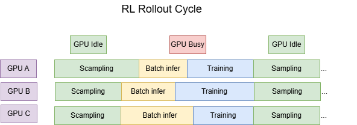
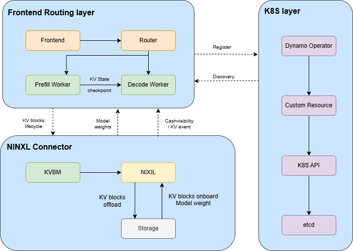
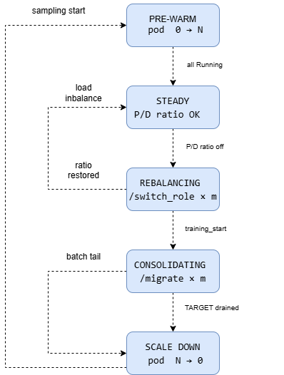
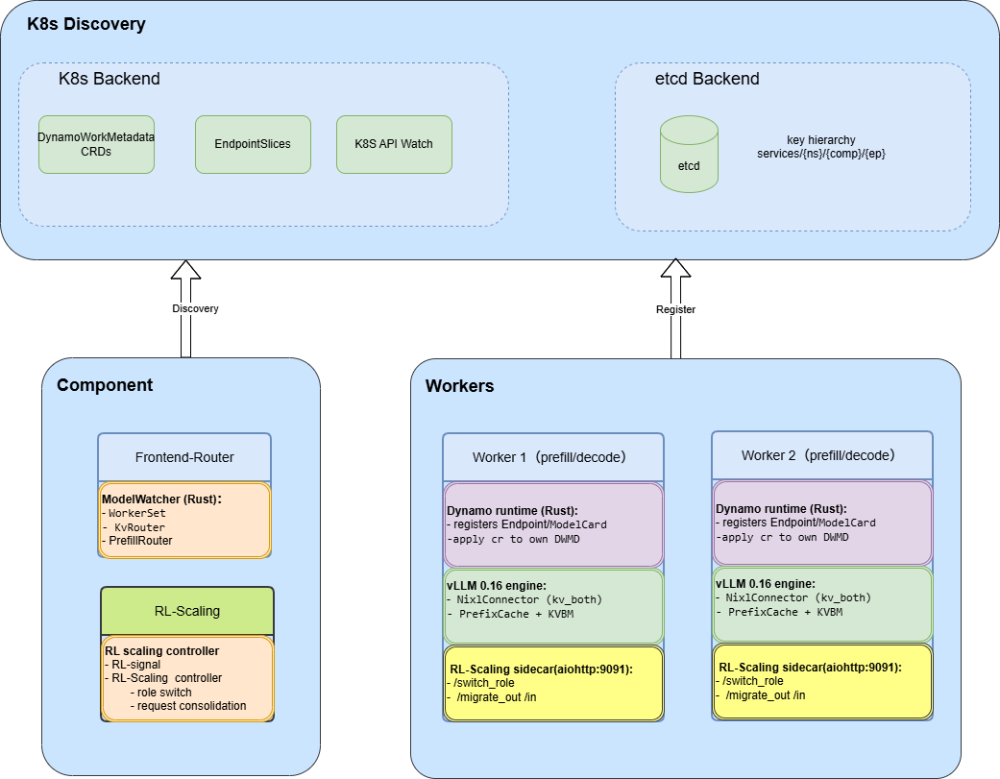
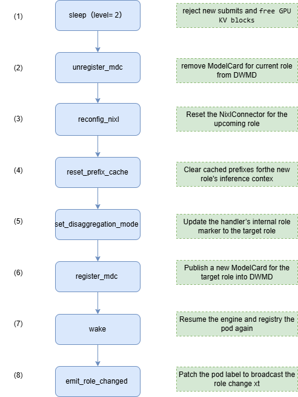
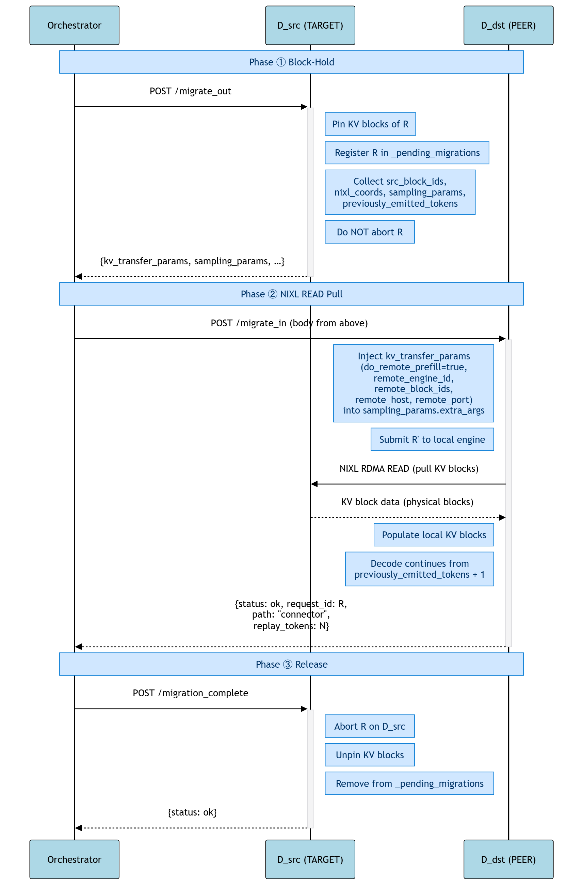

# Cloud-Native Autoscaling for Disaggregated LLM Inference: Elastic Role Switching and In-Flight Request Consolidation for RL Workloads

> Author: Shengqi ZHANG  
> Institution: HKUST MSc Thesis  
> Baseline: NVIDIA Dynamo v1.0.1  
> Date: 2026-05-19

---

## ABSTRACT

Prefill–Decode (PD) disaggregation is the mainstream LLM inference architecture (exemplified by NVIDIA Dynamo), splitting compute-bound prefill and bandwidth-bound decode onto separate GPU pools to maximize online serving efficiency. However, in reinforcement-learning (RL) post-training, inference traffic bursts periodically with rollout phases, leaving pools alternately idle and wasting GPU-hours; horizontal scaling (cold start on the order of tens of seconds) cannot react within a single rollout phase. The core question: can the decode/prefill pool sizes be reshaped within hundreds of milliseconds, without dropping in-flight requests or disturbing the router?

This report introduces two runtime primitives on Dynamo + vLLM 0.16: (1) Elastic PD Role Switching — a state-machine-driven in-place protocol that flips a worker's role via ModelCard mutation and engine sleep/wake cycling in sub-second time, with no engine rebuild or pod redeploy; (2) In-Flight Decoder Request Consolidation — a three-phase block-hold protocol that migrates running decode requests across GPUs via NIXL RDMA pull, with zero KV loss. Together with an RL-signal-driven autoscaling controller, these primitives enable the decode/prefill pools to be dynamically reshaped in lockstep with RL phases.

On a single-node Kubernetes deployment of Qwen3-0.6B, end-to-end validation shows:

* a full decode-to-prefill-to-decode round-trip completes in 963 ms of client wall-clock (453 ms + 428 ms server-side);
* an in-flight decode that had already generated 1688 tokens is migrated off the source decoder onto a peer in 188 ms via the NixlConnector RDMA path, transferring 109 physical KV blocks without recomputing the prefix;
* a sustained 2 RPS background load across the full switch+revert sequence completes 58/58 requests with zero HTTP errors.

---

## 1. INTRODUCTION

### 1.1 Overview of the NVIDIA Dynamo Serving Framework

NVIDIA Dynamo is an open-source serving framework for disaggregated LLM inference. Architecturally it is a Rust runtime that hosts (i) a frontend with kv-aware router that accepts incoming LLM inference requests, (ii) any number of worker pods each wrapping a vLLM engine, and (iii) a discovery layer that uses Kubernetes Custom Resources as the single observable source of truth for worker membership. The frontend embeds two stateful routers — KvRouter for decode dispatch and PrefillRouter for prefill dispatch — and a ModelWatcher that maintains the WorkerSet by list+watching worker metadata CRs. KV-cache transfer between prefill and decode workers is performed by the NIXL connector over NVLink / RDMA. This stack is the de facto mainstream choice today for production PD-disaggregated serving and is the baseline on which our extensions are built.

### 1.2 The RL Workload and Its GPU-Waste Problem

The cost economics of LLM inference are dominated by GPU-hours. In online chat-style serving the traffic is near-stationary; static PD partitioning works because both pools stay busy. The RL rollout loop that drives modern post-training methods (RLHF, DPO, GRPO) submits inference traffic in a fundamentally different pattern:



Each phase boundary leaves one of Dynamo's GPU pools fully busy and the other completely idle. Two compounded sources of waste result:

1. Cross-phase pool waste. During the prompt-processing burst only prefill GPUs are active, while during the long-tail generation only decode GPUs are active. The idle pool retains its GPU allocation throughout, incurring cost without contributing useful work.
2. Intra-phase tail waste. As a batch nears completion the active request count on each decoder asymptotically approaches zero, yet the GPU cannot be released until the last remaining long completion finishes.

Standard elasticity mechanisms are structurally mismatched to this workload. Horizontal pod scaling incurs a cold-start latency on the order of tens of seconds, which is one to two orders of magnitude larger than the sampling phase it would need to react inside. Moreover, each newly started pod initializes with an empty prefix cache and must re-establish NIXL connectivity, discarding the prefix-reuse benefit that PD disaggregation was designed to expose. The fundamental problem is that cold start cannot converge fast enough: by the time a new worker is ready, the phase that demanded it has already passed. Static over-provisioning, on the other hand, sizes both pools for peak demand and therefore lower-bounds GPU expenditure at that peak even while either pool is idle. Both mechanisms fail the RL controller's requirement to act within a single rollout phase.

### 1.3 Optimization Targets

We formalize the RL workload's optimization goal. The primary lever is GPU utilization:

$$
U_{\text{GPU}} = \frac{\sum_g T_{\text{compute}}(g)}{\sum_g T_{\text{allocated}}(g)}
$$

By re-roling idle GPUs into the currently-bottlenecked phase and by consolidating tail-end decode work onto fewer GPUs, the system raises useful work per allocated GPU-hour. The operation must complete in sub-second time so an RL controller can act inside one rollout phase.

### 1.4 Limitations of Current Elasticity Mechanisms

Three structural facts of the vLLM 0.16 + Dynamo v1.0.1 stack prevent existing mechanisms from supporting RL-driven elastic scaling:

1. The `kv_transfer_config` is fixed at engine construction. The NIXL connector binds to one role at engine boot. Any run-time role switch must not rebuild the engine.
2. vLLM's prefix cache is an index over KV blocks that `engine.sleep(level=2)` returns to the GPU allocator. Without a synchronized reset, a resumed engine can serve stale hits.
3. Dynamo's router is stateful. KvRouter and PrefillRouter carry radix-tree KV indices and per-worker cost models. A role change must propagate through the discovery layer and reconverge this state without disrupting in-flight requests.

### 1.5 Contributions

* (C1) An eight-step in-place role-switch state machine that atomically transitions a worker between decode and prefill roles in sub-second time. Measured: 453 ms server-side, 497 ms client wall-clock (decode to prefill); 428 / 466 ms in reverse.
* (C2) A single-TCP-slot dispatcher for partner-prefill that lets the same vLLM engine serve both decode and prefill traffic at run-time without socket re-binding.
* (C3) A three-phase block-hold NIXL-pull migration protocol that consolidates running decoders by pulling GPU KV blocks across NVLink with zero KV loss, bounded by a safety-net sweep timer.
* (C4) An RL-signal-driven autoscaling controller that consumes rollout-phase signals and dispatches the above primitives.
* (C5) End-to-end validation on a Kubernetes deployment of Qwen3-0.6B demonstrating both role-switch correctness and NIXL-path migration.

---

## 2. BACKGROUND AND RELATED WORK

### 2.1 Prefill–Decode Disaggregation

LLM inference of every request goes through two serial phases that share the same model weights but have different resource bottlenecks. The prefill phase processes all N prompt tokens in a single forward pass with full-rank attention, and is compute-bound due to large GEMMs. The decode phase generates one token at a time against the growing KV cache, and is memory-bandwidth-bound.

Co-locating both phases on one GPU (continuous batching) maximizes raw throughput but causes severe head-of-line blocking: a single long prefill stalls a batch of fast decodes. PD-disaggregated serving — pioneered by Splitwise and DistServe and now the mainstream pattern adopted by NVIDIA Dynamo, vLLM-disagg, and SGLang-disagg — splits the two phases onto separate GPU pools. The prefill pool produces the KV cache and ships it to the decode pool over a high-bandwidth fabric (NVLink / RDMA via NIXL). The advantages are: compute-bound and bandwidth-bound work no longer interfere; each pool can be sized to its own bottleneck; and prefix caching becomes a first-class cross-request optimization.

However, the split inherits a structural inefficiency: the ratio of compute to memory traffic in a workload may not match the ratio of prefill to decode GPUs that the operator provisioned, so one pool is idle while the other is the bottleneck. This mismatch is amplified in RL workloads where traffic arrives in bursts, and it is the central leverage point of this work.

### 2.2 NVIDIA Dynamo Runtime Architecture

Dynamo provides the routing and discovery substrate on top of stateful vLLM engines. Figure 1 illustrates the overall architecture.



*Figure 1 — NVIDIA Dynamo overall architecture (source: docs.dynamo.nvidia.com).*

The architecture consists of three core subsystems relevant to this work:

The discovery layer uses Kubernetes Custom Resources (one CR per worker pod) as the single source of truth for worker membership. Each worker calls strategic-merge-patch to update its own CR; the frontend's ModelWatcher reconstructs the WorkerSet from these CRs via list+watch. There is no etcd and no central registry.

The routing layer consists of KvRouter and PrefillRouter, both stateful engines. KvRouter maintains a radix-tree index over KV blocks held by each decoder, scoring candidates by prefix-overlap, queue load, and capacity. PrefillRouter fans prefill traffic to any prefill-role worker discovered through the CRs. When a worker's role changes, the router state must reconverge through CR propagation.

The NIXL connector provides zero-copy cross-GPU KV transfer over NVLink (RDMA over InfiniBand for multi-host). Combined with the KV-Block Manager (KVBM) that tracks per-request GPU-block layout, it enables a decoder to pull KV blocks directly from another worker's VRAM — the mechanism our consolidation protocol builds upon.

For our autoscaling research, Dynamo's CR-based discovery provides the critical property that role changes can be made visible to the entire system through a single metadata mutation, without restarting pods or rebuilding engines.

### 2.3 KV Cache and Prefix Caching

The KV cache stores the keys/values of every prior token so decode amortizes attention cost. Prefix caching reuses KV blocks across requests that share a prompt prefix. vLLM 0.16 keeps the cache index in CPU memory and the blocks pinned in GPU VRAM. This split is the coherence target of our role-switch protocol: the index can outlive the blocks when `engine.sleep(2)` releases them to the GPU allocator, and a stale hit at wake-up will corrupt a later request.

### 2.4 Related Systems and Distinctions

| System | Elasticity primitive | Limitation this work addresses |
|--------|----------------------|--------------------------------|
| Splitwise / DistServe | Static PD partition at deploy time | No run-time role flip |
| vLLM native scaling | Pod replicate | Cold start ~30 s; loses prefix cache |
| Mooncake | KV pool offload (CPU/SSD) | Orthogonal to PD; no role switch |
| ServerlessLLM | Cold-start optimized serverless inference | Does not handle PD-disaggregated topology |
| SpotServe | Spot instance migration | Instance-level granularity, not request-level |
| This work | In-place role switch + in-flight NIXL-pull migration | Sub-second elasticity and zero KV loss |

To our knowledge, no prior open-source serving system combines (a) sub-second in-place PD role flipping with (b) live decoder-to-decoder NIXL-pull migration, both controllable from an external RL signal.

---

## 3. SYSTEM DESIGN: RL-SIGNAL-DRIVEN AUTOSCALING

### 3.1 RL Scenarios and Design Rationale

The reinforcement-learning post-training loop presents two distinct scaling scenarios that demand different elasticity primitives:

1. Elastic PD role switch. When the RL training job transitions between sampling and training phases, the prefill/decode demand ratio shifts abruptly — early in a rollout burst prefill dominates as all prompts arrive simultaneously, while later decode dominates as long completions accumulate. The static PD partition cannot track these shifts, leaving one pool over-provisioned and the other starved. An in-place role-flip primitive is needed so that idle workers can be instantly re-roled to the bottlenecked pool without cold start.
2. Decode request consolidation. Near the end of a decode-heavy phase, a shrinking set of long-running completions is scattered across many decoders, each holding only one or two active requests. These nearly-empty decoders cannot be reclaimed or re-roled because aborting in-flight work wastes thousands of already-generated tokens. A live migration primitive is needed to consolidate remaining requests onto fewer decoders, freeing the rest for scale-down or role switch.

To address these scenarios, we propose an RL-signal-driven autoscaling architecture with three layered primitives:

| Scenario | Layer | Goal | Primitive |
|----------|-------|------|-----------|
| Rollout-driven cluster scaling | Pod replicas | Pre-warm cluster on sampling_start, drain to zero on training | Patch deployment replicas via Kubernetes API |
| Elastic role rebalancing | In-place role flip | Re-balance the prefill/decode ratio without rebuild | /switch_role |
| In-flight consolidation | Live migration | Free a target so it can be scaled down or re-roled mid-batch | /migrate |

Rollout-driven cluster scaling serves as the foundation: it simulates hot-start by pre-warming pods before a rollout begins, so that role-switching and consolidation operate on already-running engines rather than cold-starting new ones.



*Figure 2 — RL-Scaling controller architecture. The controller consumes phase signals from the RL training job and dispatches scaling primitives.*

### 3.2 Deployment Topology

The deployment extends a standard Dynamo graph deployment with one pod-local component (the RL-Scaling sidecar) and one cluster-level component (the RL-Scaling controller).



*Figure 3 — Kubernetes deployment topology showing the dual-mode worker pods, frontend, and RL-Scaling controller.*

Each dual-mode worker pod exposes three logical TCP services:

| Service | Port | Role |
|---------|------|------|
| Frontend HTTP API | :8000 (ingress) | Frontend pod | OpenAI-style chat/completions intake |
| Request-serving slot | dynamic (advertised in worker CR) | The generate endpoint that frontend routers connect to |
| System / Prometheus | :9090 | Internal metrics and health |
| RL-Scaling sidecar | :9091 | Control-plane: /switch_role, /migrate, /v1/active_requests |

The key invariant for dual-mode operation is: one pod, one engine, one TCP slot — two ModelCards (decode + prefill) take turns owning that slot. The vLLM engine is built with `--kv-transfer-config NixlConnector kv_both --kv-events-config zmq`, carrying NIXL metadata for both roles from boot. The switch_role operation never reopens any socket; it only renames the entry that the frontend's ModelWatcher observes in the worker CR.

### 3.3 Request Path

A single chat request traverses the system in the following ordered steps:

1. The client issues `POST /v1/chat/completions` to the frontend on `:8000`.
2. Under PD-disaggregated mode, `PrefillRouter` first selects a prefill worker from the prefill subset of the WorkerSet, dispatches the prompt to it, and receives `kv_transfer_params` describing the KV blocks the prefill worker has produced.
3. `KvRouter` selects a decoder by scoring each candidate's radix-tree prefix-block overlap, queue load, and remaining KV capacity, then drawing via `softmax_sample` (argmin at `temperature=0`).
4. The frontend reads the chosen worker's transport URL from the corresponding `DWMD.endpoints[…].transport.tcp` entry and connects to its dynamic TCP slot `host:port/{cid:x}/generate`.
5. The worker's `generate` handler — gated by the request-time dispatcher on dual-mode pods — runs the request through the local vLLM engine, pulling prefill KV blocks via NIXL when `kv_transfer_params` is present.
6. Generated tokens stream back over the same TCP slot to the frontend, which forwards them as SSE chunks to the client.

---


## 4. ELASTIC PD ROLE SWITCHING

### 4.1 Problem Definition

Given a running disaggregated deployment with D decoder pods and P prefill pods serving chat traffic at r RPS through the frontend, an operator wants to instruct a specific decoder pod D_i to become a prefill worker (and later come back) without restarting the pod, without dropping in-flight requests on the other pods, and within sub-second latency. Concretely, `POST <D_i>/switch_role {"target_role":"prefill"}` must achieve all of the following:

1. The chat KvRouter stops selecting D_i (its decode WorkerSet membership is withdrawn);
2. D_i's decode-side KV state is released (`engine.sleep(2)` returns GPU blocks to the allocator and `reset_prefix_cache` flushes the now-stale index);
3. D_i subsequently serves prefill traffic that the frontend's PrefillRouter dispatches to it;
4. A reverse target_role="decode" restores the above symmetrically;
5. The flip is fast enough (sub-second) that an ongoing chat workload sees at most a brief routing dip with no permanent error increase;
6. The pod's name, IP, vLLM engine identity, and prefix-cache infrastructure are unchanged; only the registered role in the worker CR and the engine's transient state are mutated.

Because the operation has internal sequencing constraints (sleep before unpublish before reset-cache before re-publish before wake), the implementation is a state machine rather than a flat script.

### 4.2 The Eight-Step State Machine

`DualModeWorker.switch_role(target)` runs under a per-worker async lock and proceeds through eight deterministic states; each transition is timed and surfaced in the JSON response's `timings_ms` field.



*Figure 4 — Eight-step switch_role state machine.*


### 4.3 Critical Ordering Constraints

Three orderings make the protocol safe:

(1) before (2): pause before unpublish. Removing the ModelCard only stops new router decisions; it does not abort flights already on the wire. pause_generation rejects new local submissions before the engine sleeps, eliminating the race where a request lands on a half-asleep engine.

(2) before (4): unregister before cache reset. This starts the (eventually-consistent, hundreds of milliseconds) frontend-watcher timer as early as possible.

(4) inside the sleep window, before (7): reset cache while engine is asleep. vLLM's prefix cache holds block-IDs that `sleep(2)` returns to the allocator. Reset-after-wake is unsafe because the wake-up race could allocate one of those blocks to a new request before we flush the index. Reset-while-asleep is atomic from the scheduler's perspective:

```
before sleep:    prefix_cache[hash("system: …")] → block #42
sleep(2):        block #42 returned to free pool
reset_pc:        index cleared           ← we are here
wake_up:         no stale hits possible
```

(6) after (4): publish only when the engine is in a consistent target state. This guarantees that traffic arriving via the new ModelCard lands on an engine that can serve it.

### 4.4 Why kv_role=kv_both Is Load-Bearing

vLLM's kv_transfer_config is fixed at engine construction. Run-time mutation would require an engine rebuild (at least 5 seconds plus prefix-cache loss). We instead build one engine that knows about both roles from boot:

```
--kv-transfer-config NixlConnector kv_both --kv-events-config zmq
```

Under kv_both the engine registers NIXL metadata for both prefill-side and decode-side semantics. The role switch is then purely (i) a registration change in the worker CR (which ModelCard is published) and (ii) an engine-state cycle (sleep, reset, wake) to discard transient state inconsistent under the new role.

### 4.5 Partner-Prefill: One TCP Slot, Two ModelCards

When partner-prefill is enabled, the post-switch pod becomes a first-class prefill worker that the frontend's PrefillRouter actually dispatches traffic to. Two non-obvious behaviours were required:

(a) Multi-chunk merge of kv_transfer_params. vLLM 0.16's NixlConnector publishes kv_transfer_params only on the last RequestOutput chunk, but Dynamo's Rust PrefillRouter reads disaggregated_params only from the first chunk. A wrapper consumes the entire stream, captures the last observed kv_transfer_params, and yields a merged chunk so the router sees the field on chunk #1.

(b) Single TCP-slot dispatcher. Dynamo's SharedTcpServer stores handlers in a map keyed by endpoint path. Because the connection_id is process-level, a naive registration of both decode and prefill on the same engine would collide. The fix is to register exactly one TCP handler and dispatch at request time:

```python
async def _generate_dispatch(request, context):
    if dm.current_role == "prefill" and partner_prefill_handler is not None:
        async for chunk in _partner_prefill_generate(request, context):
            yield chunk
        return
    async for chunk in handler.generate(request, context):
        yield chunk
```

switch_role flips current_role between steps (3) and (6), so by the time the new ModelCard is observable on the frontend the dispatcher routes correctly.

### 4.6 End-to-End Correctness via Kubernetes Service Discovery

The protocol's correctness does not rely on any in-process coordination between worker and frontend — it relies entirely on the cluster control plane. The propagation chain on every flip is:

```
Worker mutates own CR → K8s API server (etcd write) → kube informer (watch event) → Frontend ModelWatcher (re-converge WorkerSet + invalidate routers)
```

Several non-obvious properties fall out of this design, as illustrated in the deployment topology (Figure 3):

* Pod identity is invariant. The pod's name, IP, vLLM engine, and prefix-cache infrastructure do not change across a switch. Only the worker CR's model_cards entry changes. `kubectl get pods -w` shows no event; only the worker metadata CR shows the diff.

* The worker CR is the single observable truth. Any external observer — the frontend, a test harness, or kubectl — sees the same view. Tests assert directly on this surface.

* No Kubernetes Service is on the chat path. The request-serving slot is on a dynamically-allocated runtime port advertised in the worker CR. Removing a pod from the WorkerSet means removing its ModelCard from the CR — Service objects are irrelevant.

* Eventual consistency is bounded. Empirically the watcher converges in well under 200 ms on a single-node cluster; the protocol absorbs this latency by ordering the unregister early (step 2) and the publish late (step 6).

How to verify a switch actually happened. A test or operator confirms a successful flip by composing three independent observations:

1. CRD diff: inspect worker metadata before and after; assert that the decode model_card key disappears and (if partner-prefill) a prefill key appears.
2. Frontend log: ModelWatcher emits a Removed event correlated with the CR change.
3. Workload attribution: post-switch chat probes confirm the target's prompt_tokens_total Prometheus counter grows (proving partner-prefill is serving) while its decode attribution is zero.

---

## 5. IN-FLIGHT DECODER REQUEST CONSOLIDATION

### 5.1 Problem Definition

The role-switch protocol lets us shrink the decoder pool if the target decoder has no live requests — but a switch_role issued mid-flight terminates whatever was running. For long completions (e.g., max_tokens = 8000) with thousands of already-generated tokens, throwing the work away is wasteful. We therefore need an operator-callable primitive that migrates a running request from one decoder to another, leaving the source drainable, while guaranteeing that no KV state is lost or corrupted.

### 5.2 The Three-Phase Block-Hold NIXL-Pull Protocol

The protocol moves a request R from a source decoder D_src to a destination decoder D_dst in three coordinated phases. The defining property is that D_src keeps the request alive and the KV blocks pinned across the entire handshake, releasing them only after D_dst has confirmed acceptance. Combined with NIXL's RDMA-style READ semantics, this gives a strict guarantee: at every instant of the protocol, the request's KV state exists on at least one GPU as Figure 5 shows:



*Figure 5 — Three-phase block-hold NIXL-pull migration sequence.*

Phase 1 (Block-Hold): The orchestrator calls migrate_out on D_src. D_src pins the KV blocks of R, registers R in pending migrations, collects source block IDs, NIXL coordinates, sampling parameters and previously emitted token count, but does NOT abort R. It returns kv_transfer_params and sampling_params to the orchestrator.

Phase 2 (NIXL READ Pull): The orchestrator calls migrate_in on D_dst with the parameters from Phase 1. D_dst applies the cost-benefit gate, injects kv_transfer_params into the request, submits the new request to its local engine. The NixlConnectorScheduler issues an RDMA READ to D_src's GPU, populates local KV blocks, and begins decoding from previously_emitted_tokens + 1.

Phase 3 (Release): The orchestrator calls migration_complete on D_src. D_src aborts R, unpins KV blocks, and removes the entry from pending migrations.

The KV-consistency guarantee satisfies an at-least-one-copy invariant: no transition step ever leaves the request without an authoritative KV copy. If the orchestrator crashes between Phase 2 and Phase 3, the source has not aborted R, so the failure mode degrades to at-most-once duplicate emission rather than KV-state loss.

A two-phase variant — abort on migrate_out, then submit on migrate_in — is unsafe under NIXL pull. If D_src aborts first, its KV blocks are freed and may be reused by another request before the D_dst NIXL READ completes, resulting in a silent correctness violation. The three-phase protocol decouples acceptance (migrate_in returns ok) from cleanup (migration_complete), turning a two-party race into a sequential handshake.

### 5.3 Migration Strategy

The protocol moves one specified request between two specified decoders. The strategy layer answers the harder questions: which request to drain, and onto which peer.

Per-pod request registry. Each worker maintains an in-process request registry updated at submission, on every streaming delta, and on completion. The registry answers which requests this decoder currently owns and how much progress each has made.

Source-side victim selection. When migrate_out is called, the source selects the request with the largest generated token count. Migrating the most-progressed request maximizes the marginal cost saved per migration and minimizes aggregate protocol overhead per saved token.

Destination-side admission. The cost-benefit gate rejects migrate_in when the request is structurally not worth migrating (replay cost exceeds threshold, too few tokens generated, or too few tokens remaining). A declined migrate_in returns status=declined before committing any engine state.

Controller-level peer choice. The controller enumerates peer decoders from the WorkerSet, ranks them by load score (active requests, generation throughput, queue depth), and picks the least-loaded eligible peer with spare KV capacity.

### 5.4 Block-Hold Safety Net

A background task sweep_stale_migrations runs every second and force-completes any pending migration entry older than the configured hold timeout (default 10 s). This prevents a crashed orchestrator from indefinitely pinning KV blocks on the source.

### 5.5 Client-Side Continuity

migrate_in carries previously_emitted_tokens, the count of tokens already streamed to the client by D_src. The destination's streaming consumer skips this prefix so the client receives exactly one logical stream across the migration boundary. The chat-completion path handles this transparently because each migration produces a fresh SSE stream.

---

## 6. VERIFICATION AND TESTING

### 6.1 Experimental Environment

* Single-node Kubernetes 1.34.1, namespace dynamo-system
* Model: Qwen/Qwen3-0.6B with PD disaggregation
* 1 frontend, 2 decoders, 1 prefill (all Running)
* Dual-mode enabled with partner-prefill and NIXL connector

### 6.2 Elastic Role Switch — Measured Cost

|                          | decode to prefill | prefill to decode |
|--------------------------|-----------------:|-----------------:|
| sleep                    | 65.8 ms          | 50.3 ms          |
| unregister_mdc           | 22.8 ms          | 19.4 ms          |
| reconfig_nixl            |  0.1 ms          |  0.1 ms          |
| reset_prefix_cache       |  4.3 ms          |  1.2 ms          |
| register_mdc             | 326.7 ms         | 328.1 ms         |
| wake                     | 20.2 ms          | 28.8 ms          |
| Server-side total        | 453.5 ms         | 428.0 ms         |
| Client wall clock        | 497.3 ms         | 465.7 ms         |
| Full round-trip (client) |       | 963.0 ms |

register_mdc dominates (Kubernetes apply round-trip); the engine-side cost is essentially sleep + wake at approximately 90 ms. Both directions are symmetric because partner-prefill publishes a prefill ModelCard on decode-to-prefill and re-publishes the decode ModelCard on prefill-to-decode.

### 6.3 Elastic Role Switch — Correctness Verification

An automated end-to-end test executes the full decode-to-prefill-to-decode switch cycle while maintaining a 2 RPS background chat load. Five pass conditions:

| Code | Meaning |
|------|---------|
| PASS_CR_D2P | After switch to prefill, TARGET's CR loses its decode model_card key |
| PASS_CR_P2D | After revert to decode, the same model_card key reappears |
| PASS_PREFILL_SERVING | TARGET's prompt_tokens_total grew during the post-switch probe window |
| PASS_DECODE_SERVING | TARGET's generation_tokens_total grew during the post-revert probe window |
| PASS_LOAD | Background 2 RPS load over the full switch+revert: error_count = 0 |

Direct CRD diff (decode to prefill):

```diff
- dynamo-system-vllm-v1-disagg-router-…/backend/generate/<inst>
+ dynamo-system-vllm-v1-disagg-router-…/prefill/generate/<inst>
```

Workload attribution:

| Phase | Probes | HTTP 200 | Counter delta on TARGET |
|-------|------:|---------:|-----------------------:|
| After switch to prefill | 30 | 30 | prompt_tokens_total delta = +583 |
| After revert to decode  | 30 | 30 | generation_tokens_total delta = +224 |

Sustained background load (2 RPS for 30 s, covering the full switch+revert):

| metric | value |
|--------|------:|
| total requests | 58 |
| HTTP 200 | 58 |
| HTTP non-200 | 0 |

All five conditions passed.

### 6.4 In-Flight Consolidation — NIXL Connector Path Verified

To verify that the protocol actually transfers KV state via the NIXL RDMA connector (rather than falling back to recompute-prefill), we designed an end-to-end integration test. The harness submits 5 streaming completions (max_tokens=3000), waits for decoding to begin, then drives the full three-phase migration sequence. Six pass conditions:

| Code | Meaning |
|------|---------|
| PASS_KV_TRANSFER   | migrate_out response carries populated kv_transfer_params (NIXL coords + remote block IDs) |
| PASS_BLOCK_IDS     | The list src_block_ids is non-empty: real physical GPU KV-cache blocks were identified |
| PASS_CONNECTOR_PATH| migrate_in response reports path = connector (NixlConnector was invoked, not recompute fallback) |
| PASS_TOKENS_BEFORE | The source had already decoded N > 0 tokens before migration; destination resumes from N + 1 |
| PASS_COMPLETE      | All 5 streaming requests eventually finished with valid content |
| PASS_MIG_OK        | At least 1 (migrate_out, migrate_in) pair returned status=ok |

Per-migration NIXL evidence:

| Field | Value | Interpretation |
|-------|-------|----------------|
| tokens_before_migration | 1688 | Source had already produced 1688 tokens locally |
| migrate_in.path | connector | NIXL connector was used, not recompute |
| migrate_in.replay_tokens | 1688 | Replay budget equals source progress, confirming KV cache transfer |
| Migration round-trip | 188 ms | Two orders of magnitude faster than recomputing 1688-token prefix |
| kv_transfer_params.remote_block_ids | 109 physical blocks | Exact GPU pages transferred via RDMA READ |

Scaled-load orchestration evidence. A separate run exercised six concurrent migrations on the same orchestration framework, exhibiting mean block-hold latency of 6.1 ms and zero errors, with Prometheus delta of generation_tokens_total = +45737 between settle and drain. This confirms that the three-phase block-hold orchestration scales to multiple in-flight migrations without leaks.

Cost-benefit gate. A synthetic migrate_in with prompt_tokens=9000 returns status=declined with reason exceeding max_replay_tokens, confirming the destination-side admission gate.

All six pass conditions met; the NIXL connector path is verified as the migration mechanism.

### 6.5 Experimental Summary

| Scenario | Conditions met | Headline timing | Errors |
|----------|:--------------:|-----------------|:------:|
| Role switch  | 5 / 5 | 497 ms d-to-p, 466 ms p-to-d (client wall-clock); 963 ms round-trip | 0 |
| Consolidation (NIXL-path)   | 6 / 6 | 188 ms per migration; 109 KV blocks transferred via NixlConnector | 0 |
| Consolidation (orchestration at scale) | aux. | 6 concurrent migrations, mean block-hold 6.1 ms | 0 |

---

## 7. DISCUSSION AND FUTURE WORK

### 7.1 Discussion

(a) register_mdc dominates the switch cost. At approximately 327 ms it is roughly 3.5x the engine-side sleep + wake cost. This is a Kubernetes apply round-trip, fundamental to our choice of the worker CR as the single source of truth. The trade-off is strong observability and zero new infrastructure versus a ~330 ms floor on flip latency. For an RL controller that flips on the order of once per rollout phase (tens of seconds), this is acceptable.

(b) Three-phase NIXL pull is verified end-to-end. The validation demonstrates that with the KVBM block-bridge wired through, migrate_in takes the connector path. The 188 ms wall-clock cost is dominated by RDMA setup; the source-side block-hold window remains short (single-digit ms in the orchestration-scale run), bounded by the at-least-one-copy invariant. The recompute-prefill fallback is retained as a safety net but is no longer the active path.

(c) The single-TCP-slot dispatcher generalizes. The same lesson — a process-level connection_id collides any two endpoints sharing the same endpoint_name — applies to any future dual-role endpoint Dynamo grows. The dispatcher pattern is a useful template.

(d) Single-host evaluation. Network costs in this evaluation are loopback-bound. Multi-host deployments will pay one additional round-trip per phase (CR propagation, plus NIXL setup over RDMA); we expect the switch wall-clock to remain under approximately 700 ms with a healthy cluster.

### 7.2 Future Work

1. Cluster-wide measurement. Reproduce the validation on a multi-node cluster with RDMA NIXL; quantify additional register_mdc and NIXL-pull latencies.
2. Closed-loop RL controller. Wire the RL-Signal SDK into the controller's state machine; replace manually-triggered switch_role / migrate calls with policy-driven dispatch evaluated on a real GRPO rollout.
3. Expose KVBM block index by default, making three-phase NIXL pull the common path; this requires upstream cooperation with vLLM 0.17+.
4. Pluggable scheduling to short-circuit softmax_sample during a transient PD imbalance and accelerate the router's reaction to a flip.
5. Multi-engine support. Extend the dispatcher and dual-mode plumbing to non-vLLM engines (SGLang, TRT-LLM) that support a similar dual-role configuration.

---

## REFERENCES

1. NVIDIA, "Dynamo: A Disaggregated Inference Serving Framework," 2024. Available: https://github.com/ai-dynamo/dynamo
2. W. Kwon, Z. Li, S. Zhuang, et al., "Efficient Memory Management for Large Language Model Serving with PagedAttention," in Proc. SOSP, 2023.
3. R. Qin, Z. Li, W. He, et al., "Mooncake: Trading More Storage for Less Computation — A KVCache-Centric Architecture for Serving LLM Chatbot," in Proc. USENIX FAST, 2025, pp. 155–170.
4. Y. Zhong, S. Liu, J. Chen, et al., "DistServe: Disaggregating Prefill and Decoding for Goodput-optimized Large Language Model Serving," in Proc. OSDI, 2024.
5. P. Patel, E. Choukse, C. Zhang, et al., "Splitwise: Efficient Generative LLM Inference Using Phase Splitting," in Proc. ISCA, 2024.
6. NVIDIA, "NIXL: NVIDIA Inference eXchange Library," 2024. Available: https://github.com/ai-dynamo/nixl
7. Y. Liu et al., "LMCache: An Efficient KV Cache Layer for Enterprise-Scale LLM Serving," 2024.
8. Y. Fu, L. Xue, S. Huang, et al., "ServerlessLLM: Low-Latency Serverless Inference for Large Language Models," in Proc. OSDI, 2024.
9. X. Miao, C. Shi, J. Duan, et al., "SpotServe: Serving Generative Large Language Models on Preemptible Instances," in Proc. ASPLOS, 2024.
